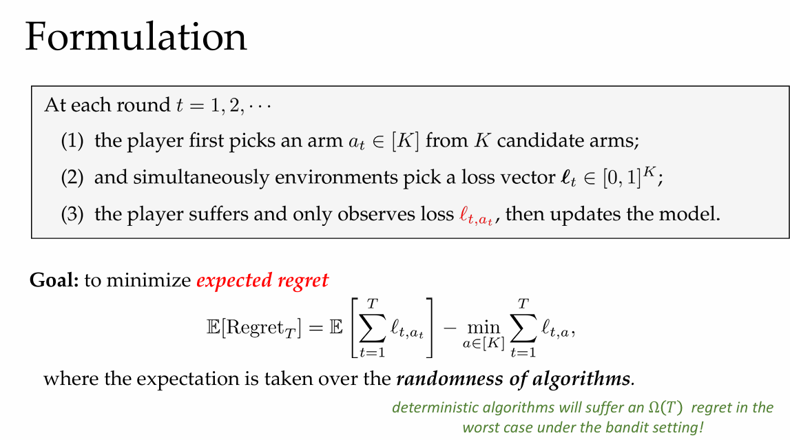

# Lecture 10. Adversarial Bandits

# Part 1. Bandits

## Bandit Problems
- partial information (bandits): observe function value $f_t(\mathbf{x}_t)$ only

- Exploration-Exploitation tradeoff

- Also called partial-information online learning. [受限信息反馈下的在线学习]

## Adversarial Bandits

# Part 2. (Adversarial) Multi-Armed Bandits [MAB]

## Formulation
- 

- E : 算法基于随机性

## Loss Estimator

## Exp3 and Regret Analysis

