# Chap6-Online Mirror Descent

#  Prediction with Expert Advice
## Problem Setup
- 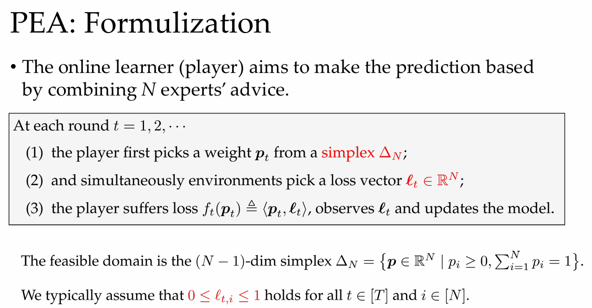

目标:最小化累计损失，使其接近最好专家的表现
$$\begin{aligned}&\text{Regret}_T\triangleq\sum_{t=1}^T\langle\boldsymbol{p}_t,\boldsymbol{\ell}_t\rangle-\min_{\boldsymbol{p}\in\Delta_N}\sum_{t=1}^T\langle\boldsymbol{p},\boldsymbol{\ell}_t\rangle=\sum_{t=1}^T\langle\boldsymbol{p}_t,\boldsymbol{\ell}_t\rangle-\min_{i\in[N]}\sum_{t=1}^T\ell_{t,i}\end{aligned}$$

## Algorithms
-  Follow the Leader (FTL)

$$\begin{aligned}
\boldsymbol{p}_{t}^{\mathrm{FTL}} & =\arg\min_{\boldsymbol{p}\in\Delta_N}\left\langle\boldsymbol{p},L_{t-1}\right\rangle=\operatorname{argmin}_{i\in[N]}L_{t-1,i} \\
\mathrm{where~}L_{t-1} & \in\mathbb{R}^N\text{ is the cumulative loss vector with }L_{t-1,i}\triangleq\sum_{s=1}^{t-1}\ell_{s,i}.
\end{aligned}$$

- Hedge: 用 “softmax” 替代 FTL 中的 “max”

- - lazy update: $p_{t+1,i}\propto\exp{(-\eta L_{t,i})},\forall i\in[N]\quad L_{t,i}=\sum_{s=1}^{t}\ell_{s,i},\forall i\in[N]$

- - greedy update: $p_{t+1,i}\propto p_{t,i}\exp{(-\eta\ell_{t,i})},\forall i\in[N]$

## Regret Analysis
**Theorem 1. Upper Bound of Hedge**

设 $\forall t\in[T]$ and $i\in[N],0\leq\ell_{t,i}\leq1,$ 则 Hedge 有以下bound:

$$\mathrm{Regret}_T\leq\frac{\ln N}\eta+\eta T \overset{\eta=\sqrt{(\ln N)/T}}{=} \mathcal{O}(\sqrt{T\log N}),$$

**Theorem 2 (Lower Bound of PEA)**.

For any algorithm A, we have that
$$\sup_{T,N}\max_{\boldsymbol{\ell}_1,\ldots,\boldsymbol{\ell}_T}\frac{\mathrm{Regret}_T}{\sqrt{T\ln N}}\geq\frac1{\sqrt{2}}.$$

# Online Mirror Descent (OMD) Framework
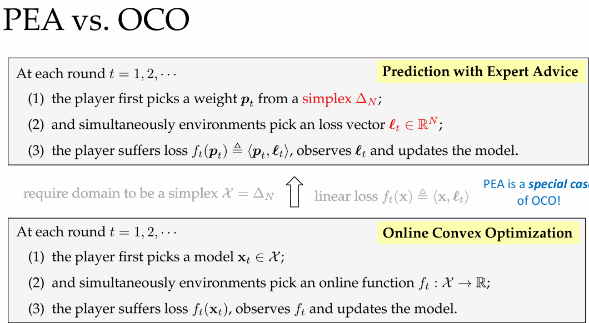
## Deploying OGD to PEA
- OGD中,取$\eta = \frac{D}{G\sqrt{T}}$,其中$D$为可行域$X$直径, $G$为$\|\nabla f_t\|$的上界,则有$Regret_T=\mathcal{O}(GD \sqrt{T})$.
- PEA中,可行域为$\Delta_N$,直径$D=\sqrt{2}$, $\|\nabla l_t\|\leq\sqrt{N}$,代入上式,则有$Regret_T=\mathcal{O}(\sqrt{TN})$,与上述分析得到的$Regret_T=\mathcal{O}(\sqrt{T\ln N})$不符
- 原因:PEA有OCO不具有的良好结构[simplex domain]
- 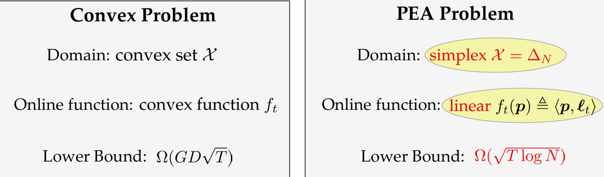

- 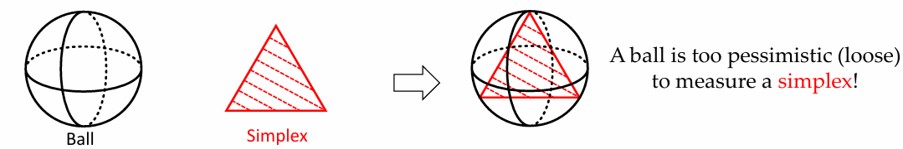
- OCO的距离度量: 2-norm(ball)
- - $\mathbf{x}_{t+1}=\arg\min_{\mathbf{x}\in\mathcal{X}}\left\{\eta_t\langle\mathbf{x},\nabla f_t(\mathbf{x}_t)\rangle+\frac{1}{2}\left\|\mathbf{x}-\mathbf{x}_t\right\|_2^2\right\}$
- PEA的距离度量: KL divergence( the decision can be viewed as a distribution within the simplex)
- - $\operatorname{KL}(P\|Q)=\sum_{x\in\mathcal{X}}P(x)\log\left(\frac{P(x)}{Q(x)}\right)$
- - $\mathbf{x}_{t+1}=\arg\min_{\mathbf{x}\in\mathcal{X}}\left\{\eta_t\langle\mathbf{x},\nabla f_t(\mathbf{x}_t)\rangle+\mathrm{KL}(\mathbf{x}\|\mathbf{x}_t)\right\}$
- 更通用的距离度量: Bregman divergence
- - $\mathbf{x}_{t+1}=\arg\min_{\mathbf{x}\in\mathcal{X}}\left\{\eta_t\langle\mathbf{x},\nabla f_t(\mathbf{x}_t)\rangle+\mathcal{D}_\psi(\mathbf{x},\mathbf{x}_t)\right\}$

**Def1 (Bregman Divergence)**

$\psi$ 是凸集 $\mathcal{X}$ 上的强凸且可微函数 , for any $\mathbf{x},\mathbf{y}\in\mathcal{X}$, $\mathcal{D}_\psi$ associated to $\psi$ is defined as

$$\mathcal{D}_\psi(\mathbf{x},\mathbf{y})=\psi(\mathbf{x})-\psi(\mathbf{y})-\langle\nabla\psi(\mathbf{y}),\mathbf{x}-\mathbf{y}\rangle.$$

- Bregman divergence measures the difference of a function and its linear approximation
- 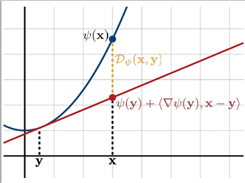

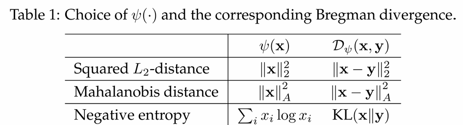
- $\sum_{x_i}= \sum_{y_i}=1$
## OMD Algorithmic Framework
At each round $t=1,2,\cdots$

$$\mathbf{x}_{t+1}=\arg\min\limits_{\mathbf{x}\in\mathcal{X}}\left\{\eta_t\langle\mathbf{x},\nabla f_t(\mathbf{x}_t)\rangle+\mathcal{D}_\psi(\mathbf{x},\mathbf{x}_t)\right\}$$

where $\mathcal{D}_\psi(\mathbf{x},\mathbf{y})=\psi(\mathbf{x})-\psi(\mathbf{y})-\langle\nabla\psi(\mathbf{y}),\mathbf{x}-\mathbf{y}\rangle$ is the Bregman divergence.
## Regret Analysis
- 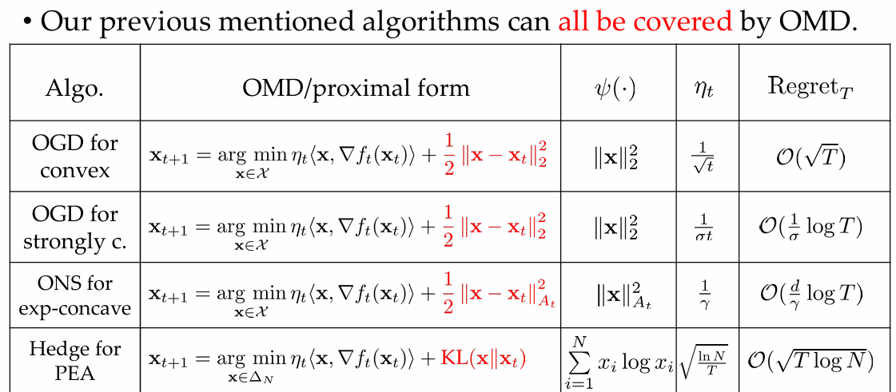

**Theorem 4 (General Regret Bound for OMD).**

Assume $\psi$ is λ-strongly convex w.r.t. $\|\cdot\|$
and $\eta_{t}=\eta,\forall t\in[T].$ Then, for all u $\in\mathcal{X}$,the following regret bound holds

$$\sum_{t=1}^Tf_t(\mathbf{x}_t)-\sum_{t=1}^Tf_t(\mathbf{u})\leq\frac{\mathcal{D}_\psi(\mathbf{u},\mathbf{x}_1)}\eta+\frac\eta\lambda\sum_{t=1}^T\left\|\nabla f_t(\mathbf{x}_t)\right\|_\star^2-\frac1\eta\sum_{t=1}^T\mathcal{D}_\psi(\mathbf{x}_{t+1},\mathbf{x}_t)$$

### **Lemma 1 Mirror Descent Lemma**
- 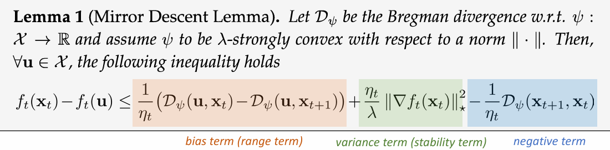
- 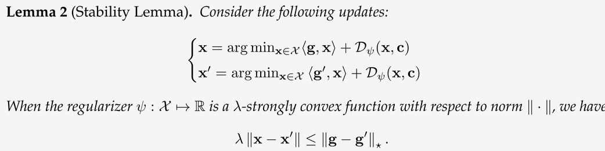
- 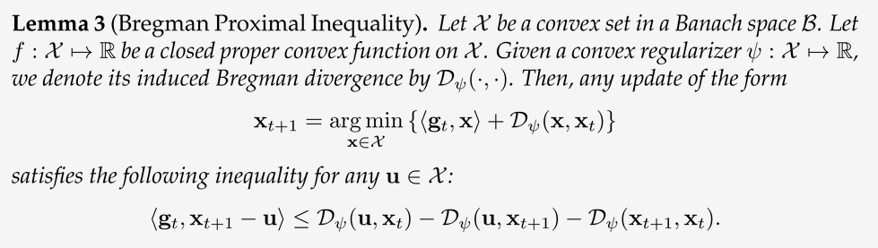

- 由lemma2,代入
$$\begin{cases}
\mathbf{x_{t+1}}=\arg\min_{\mathbf{x}\in\mathcal{X}}\langle \mathbf{\eta_t \nabla f_t(x_t)},\mathbf{x}\rangle+\mathcal{D}_\psi(\mathbf{x},\mathbf{x_t}) \\
\mathbf{x_t}=\arg\min_{\mathbf{x}\in\mathcal{X}}\langle\mathbf{0},\mathbf{x}\rangle+\mathcal{D}_\psi(\mathbf{x},\mathbf{x_t}) & 
\end{cases}$$
- - 得到$\lambda\left\|\mathbf{x_{t+1}}-\mathbf{x_t}\right\|\leq\left\|\eta_t \nabla f_t(x_t)\right\|_\star = \eta_t\left\|\nabla f_t(x_t)\right\|_\star$
- - $\Rightarrow\langle\nabla f_t(\mathbf{x}_t),\mathbf{x}_t-\mathbf{x}_{t+1}\rangle\leq\frac{\eta_t}{\lambda}\|\nabla f_t(\mathbf{x}_t)\|_\star^2$

- 由lemma3,代入
$$\langle \eta_t \nabla f_t(\mathbf{x}_t),\mathbf{x}_{t+1}-\mathbf{u}\rangle \leq \mathcal{D}_{\psi}(\mathbf{u},\mathbf{x}_{t})-\mathcal{D}_{\psi}(\mathbf{u},\mathbf{x}_{t+1})-\mathcal{D}_{\psi}(\mathbf{x}_{t+1},\mathbf{x}_{t})$$
- - 得到$\langle \nabla f_t(\mathbf{x}_t),\mathbf{x}_{t+1}-\mathbf{u}\rangle \leq \frac{1}{\eta_t} (\mathcal{D}_{\psi}(\mathbf{u},\mathbf{x}_{t})-\mathcal{D}_{\psi}(\mathbf{u},\mathbf{x}_{t+1})-\mathcal{D}_{\psi}(\mathbf{x}_{t+1},\mathbf{x}_{t}))$

- 综上, 可证lemma1:

$$\begin{aligned}
f_t(\mathbf{x}_t)-f_t(\mathbf{u})&\leq\langle\nabla f_t(\mathbf{x}_t),\mathbf{x}_t-\mathbf{x}_{t+1}\rangle+\langle\nabla f_t(\mathbf{x}_t),\mathbf{x}_{t+1}-\mathbf{u}\rangle \\ &\leq\frac{\eta_t}{\lambda}\|\nabla f_t(\mathbf{x}_t)\|_\star^2+\frac{1}{\eta_t}(\mathcal{D}_{\psi}(\mathbf{u},\mathbf{x}_{t})-\mathcal{D}_{\psi}(\mathbf{u},\mathbf{x}_{t+1})) - \frac{1}{\eta_t}\mathcal{D}_{\psi}(\mathbf{x}_{t+1},\mathbf{x}_{t})
\end{aligned}$$

**Theorem 4 (General Regret Bound for OMD).**

根据lemma1,若 ψ is λ-strongly convex w.r.t. $\|\cdot\|$
and $\eta_t=\eta$, 则$\forall t\in[T], \forall u\in\mathcal{X}$,有以下遗憾界
$$\sum_{t=1}^Tf_t(\mathbf{x}_t)-\sum_{t=1}^Tf_t(\mathbf{u})\leq\frac{\mathcal{D}_\psi(\mathbf{u},\mathbf{x}_1)}\eta+\frac\eta\lambda\sum_{t=1}^T\left\|\nabla f_t(\mathbf{x}_t)\right\|_\star^2-\frac1\eta\sum_{t=1}^T\mathcal{D}_\psi(\mathbf{x}_{t+1},\mathbf{x}_t)$$

## Interpretation from Primal-Dual View
- 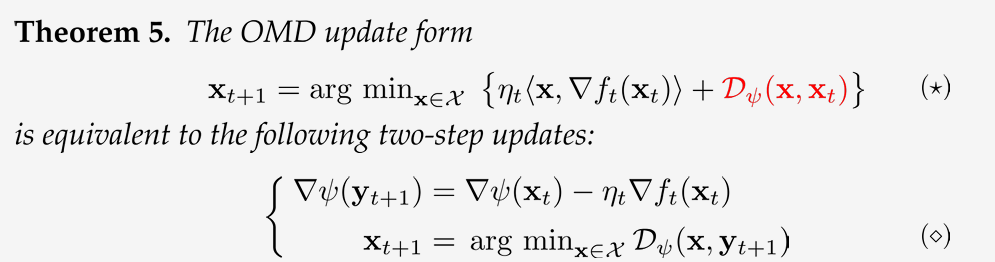

# Another OCO Framework: Follow-the-Regularized Leader [FTRL]
- Follow the Leader (FTL) : $\boldsymbol{p}_t^\mathrm{FTL}=\underset{\boldsymbol{p}\in\Delta_N}{\operatorname*{\operatorname*{arg}}}\min_{\boldsymbol{p}\in\Delta_N}\langle\boldsymbol{p},\boldsymbol{L}_{t-1}\rangle$
- - FTL is sub-optimal due to its unstable nature.
- - $\Rightarrow$ adding regularizers to stabilize the algorithm
- Follow-the-Regularized-Leader (FTRL)
- - 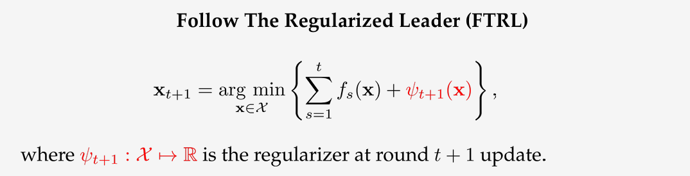

## Algorithmic Framework

## Regret Analysis

## Interpretation from Primal-Dual View

