# Adversarial Bandits

# Part 1. Bandits

## 1.1 Bandit Problems
- Also called partial-information online learning

在线学习的一般形式:
- At each round $t=1,2,\cdots$
- - (1) player 选择model $w_t \in W$
- - (2) simulaneously environment 选择online function $f_t : W \to \mathbb{R}$
- - (3) player 受到$f_t(w_t)$的损失,获取$f_t$的信息并更新模型
- - bandits: 在(3)中仅揭示$f_t(w_t)$(该点函数值)

## 1.2 Adversarial Bandits 
- 本课程针对oblivious setting(环境不会针对learner)
- 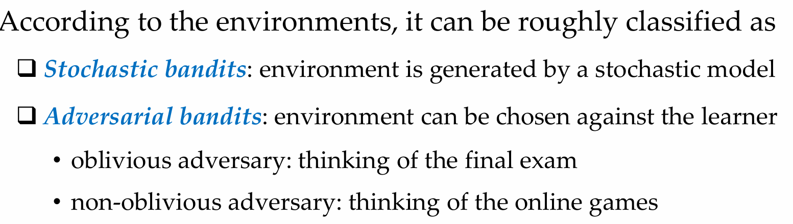

# Part 2. (Adversarial) Multi-Armed Bandits

## 2.1 Formulation
- 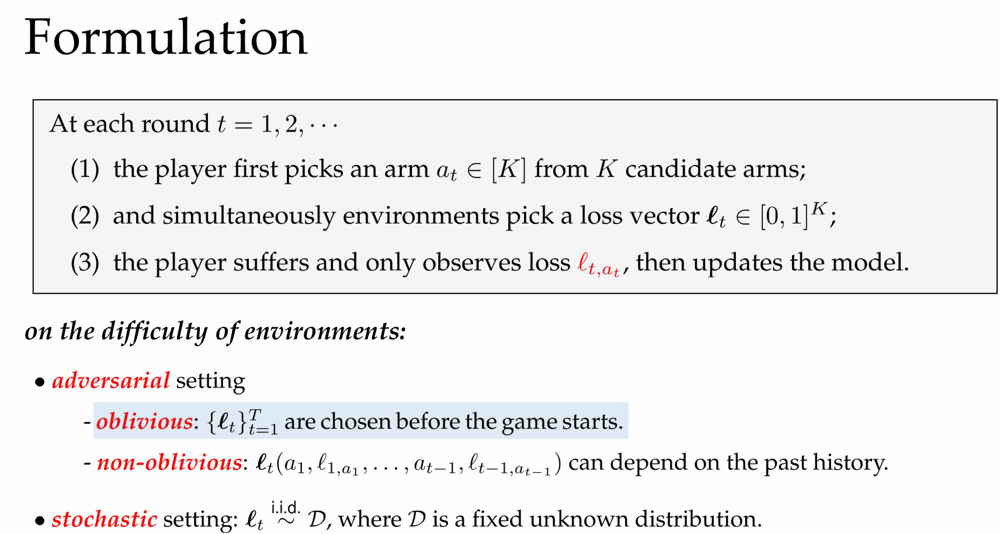
- 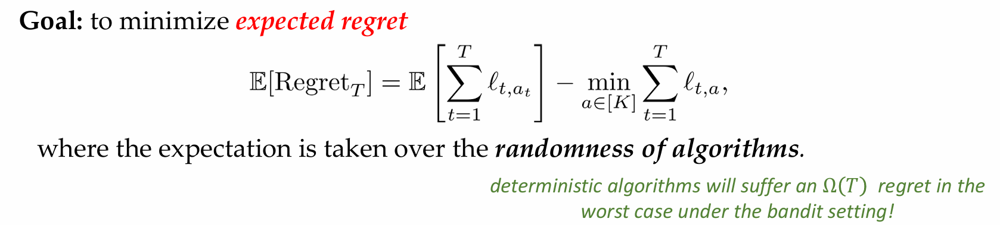
- 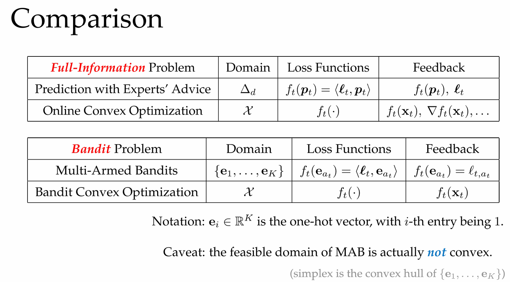
## 2.2 Loss Estimator
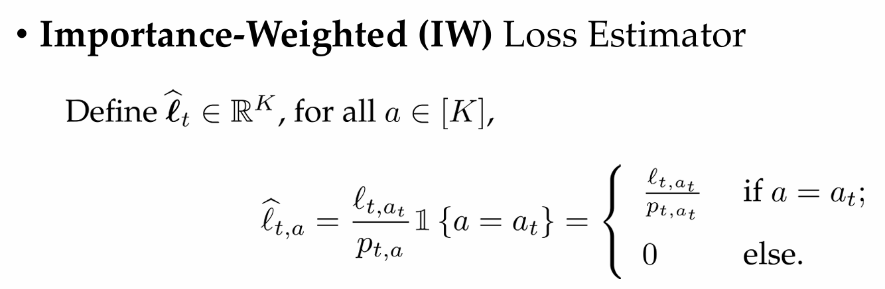

## 2.3 Exp3 and Regret Analysis
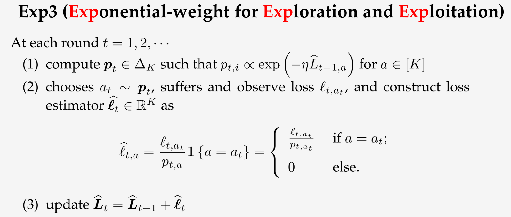

- We have proved the regret upper bound for Exp3:
$$\mathbb{E}\left[\mathrm{Regret}_T\right] \leq\mathcal{O}\left(\sqrt{TK\log K}\right)$$
- 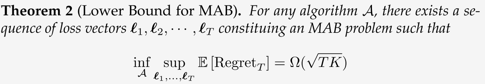
- Exp3 doesn’t achieve minimax optimal regret for MAB

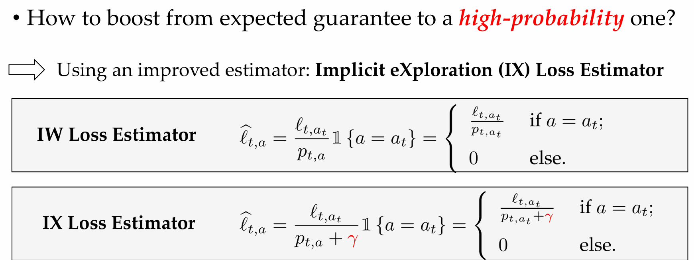

# Part 3. Bandit Convex Optimization

## 3.1 Problem Formulation

## 3.2 Gradient Estimator

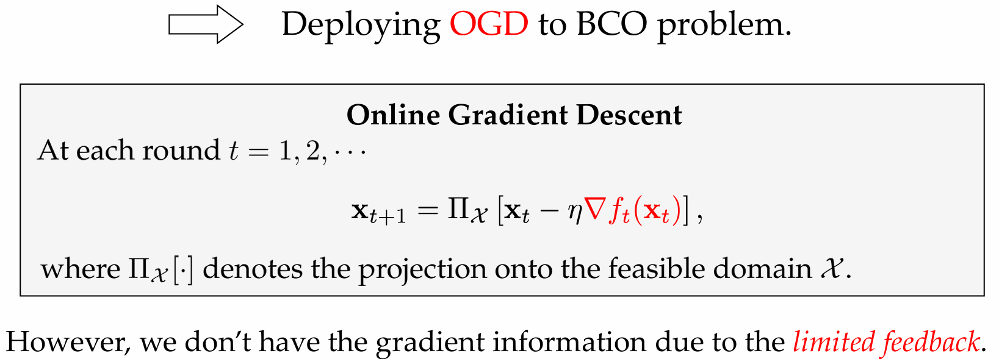
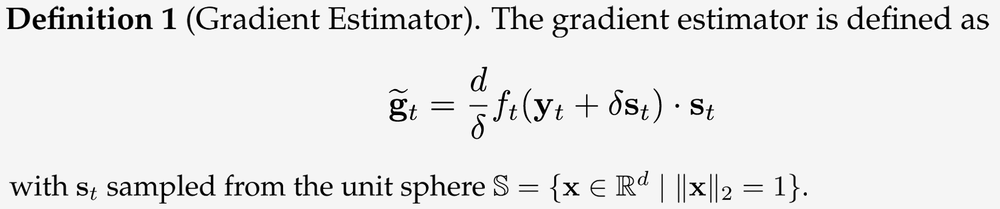
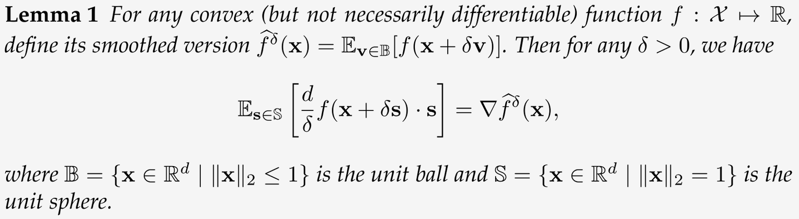

## 3.3 Bandit Gradient Descent
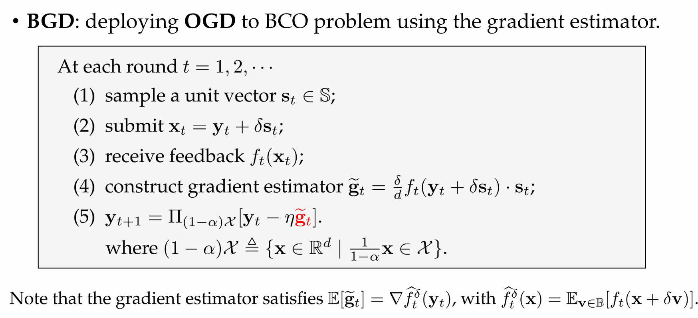

## 3.4 Regret Analysis

