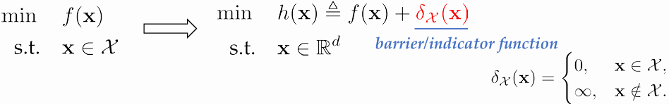

# 约束Constrained
- any optimization problem can be regarded as an unconstrained one
- 
# Convex Optimization
- 本课程专注于以下问题设置
- - Language: minimization problem
- - Objective function: continuous and convex
- - Feasible domain: a convex subset of Euclidean space
# Part 1. Convex Set and Convex Function
- **Def1 : Convex Set**
- - $X$为凸集: for any $x_1, x_2 \in X$, $x_1$ 和 $x_2$ 连成线段上的所有点属于 $X$
- - $\forall \alpha \in [0, 1], \alpha x_1 + (1 - \alpha) x_2 \in X$
- **Def2 : Ball**
- - $B(x_c, r) = \{x_c + ru | \|u\|_2 \leq 1\}$
- **Def3 : Ellipsoid**
- - $\epsilon(x_c, A) = \{x_c + Au | \|u\|_2 \leq 1\}$
- **Def4 : Convex Hull**
- - 集合X的凸包$conv X = \{\sum_{i=1}^n \alpha_i x_i | x_i \in X, \alpha_i \geq 0, \sum_{i=1}^n \alpha_i = 1\}$
- **Def5: Projection**
- - y在集合X上的投影$x = \Pi _X(y) = argmin_{x\in X} \|x - y\|_2$
- **Theorem 1: (Pythagoras Theorem)**
- - 对凸集 $X$, x = $\Pi_X(y), \forall z \in X, \|y - x\|_2 \leq \|y - z\|_2$
- **Def 6: Convex Function**
- - $f : X \to \mathcal{R}$ 为凸: 
- - 对凸集 $X$, $\forall x, y \in X, \forall \alpha \in [0, 1],f((1-\alpha)x + \alpha y) \leq (1-\alpha)f(x) + \alpha f(y)$
- **Def 7: Concave Function**
- - 对凹集 $X$, $\forall x, y \in X, \forall \alpha \in [0, 1],f((1-\;alpha)x + \alpha y) \geq (1-\alpha)f(x) + \alpha f(y)$
- **Theorem 2:**
- - 函数f为凸函数当且仅当dom f 为凸且以下任一条件成立: 
- - $\forall x, y$ in dom f, and $\alpha \in [0, 1]$:
- - 零阶条件:$f((1-\alpha)x + \alpha y) \leq (1-\alpha)f(x) + \alpha f(y)$
- - 一阶条件:$f(x) + <\nabla f(x),(y-x)> \leq f(y)$
- - 二阶条件:$\nabla^2 f(x) \succeq 0$
- **Theorem 3: Jensen's Inequality**
- - 对凸函数f, *$f(E[X]) \leq E[f(X)]$*
- - Prove:$f(\theta_1x_1 +……+ \theta_kx_k) \leq \theta_1f(x_1) +……+ \theta_kf(x_k)$
# Part 2. Convex Optimization Problem
## Setup
- We adopt a minimization language

$$\begin{aligned}\min\quad &f(\mathbf{x})\\\mathbf{s.t.} \quad &g_i(\mathbf{x})\leq0,&i=1,\cdots,m\\
&\mathbf{a}_i^\top\mathbf{x}=b_i,&i=1,\cdots,n\end{aligned}$$

- optimization variable $\mathbf{x}\in\mathbb{R}^d$
- convex objective function: $f:\mathbb{R}^d\mapsto\mathbb{R}$ 
- convex inequality constraints: $g_1,\ldots,g_m$
## Subgradients
**Definition 8 (Subgradient).** 
- Let $f : \chi \rightarrow \mathbb{R}$ be a proper function and let $x \in \chi \subseteq \mathbb{R}^d$. A vector $g \in \mathbb{R}^d$ is called a subgradient of $f$ at $x$ if
$$
f(y) \geq f(x) + \langle g, y - x \rangle, \text{ for all } y \in \mathbb{R}^d.
$$

**Definition 9 (Subdifferential).** 
- The set of all subgradients of $f$ at $x$ is called the subdifferential of $f$ at $x$ and is denoted by $\partial f(x)$,
$$
\partial f(x) = \{ g \in \mathbb{R}^d \mid f(y) \geq f(x) + \langle g, y - x \rangle, \text{ for all } y \in \mathbb{R}^d \}.
$$
- $g \in \partial f(x)$表示直线*$f(x)+<g,y-x>$*在$f$下方
  
**Theorem 4:Relationship between Lipschitznessand bounded subgradient**
- 凸函数$f:\mathcal{X}\to\mathbb{R}$. 
- - $(i)$ Lipschitzness: $| f( \mathbf{x} ) - f( \mathbf{y} ) | \leq G\| \mathbf{x} - \mathbf{y} \| \textit{for any x}, \mathbf{y} \in \mathcal{X} .$ 
- - $(ii)$ Bounded subgradient: $\|\mathbf{g}\|_*\leq G$ for any g$\in\partial f(\mathbf{x}),\mathbf{x}\in\mathcal{X}.$ 
- - 对于以上两条,有:
- - $(a)(ii)\Rightarrow(i).$
- - $( b) \textit{ if X is open,  then }( i) \Leftrightarrow ( ii) .$

**Theorem 5: Existence of Subgradient**
- $Let\,f:\mathcal{X}\mapsto\mathbb{R}$ be a proper function and assume $\mathcal{X}$ is convex.
If for any $\mathbf{x}\in\mathcal{X},its$ subgradients exist, then f is convex.
- - 凸函数的充分条件
- - 反之不然, 如$f(x)=\begin{cases}-\sqrt{x},&x\geq0\\\infty,&\text{else}\end{cases},$
- - 只考虑可行域内部的点时,反之同样成立

**Theorem 6** 对凸函数 $\,f:\mathcal{X}\mapsto\mathbb{R}$ 和凸集 $\mathcal{X}$ is convex.
则任意 interior point $\mathbf{x}\in int(\mathcal{X}), \partial f(x)$ 非空.

**Theorem 7: Subgradient的计算**
- Let $f: \mathcal{X} \mapsto \mathbb{R}$ be a proper and convex function and assume $\mathcal{X}$ is convex.
1. If $f$ is differentiable $at$ $\mathbf{x} , then$ $\partial f( \mathbf{x} ) = \{ \nabla f( \mathbf{x} ) \} .$
2. Conversely, if f has a unique subgradient, then it is differentiable at x and
$\partial f(\mathbf{x})=\{\nabla f(\mathbf{x})\}.$

## Why Convexity?
- Local to Global Phenomenon
- 梯度:提供函数在某点的局部信息
- Subgradient:提供函数在某点的全局信息

**Theorem 8**
- 设 𝑓 是凸函数。如果𝑥是 𝑓 的局部最小点，则 𝑥 是 𝑓 的全局最小点。
- Proof:
$$f(\mathbf{x})\leq f((1-\gamma)\mathbf{x}+\gamma\mathbf{y})\leq(1-\gamma)f(\mathbf{x})+\gamma f(\mathbf{y}),$$
- - Where $\gamma$ is small enough

# Part 3. Optimality Condition
## Fermat’s Optimality Condition
**Theorem 9 (Fermat's Optimality Condition)**
- $Let f: \mathbb{R} ^d\to ( - \infty , \infty ] \textit{be a proper convex function. Then}$

$$\mathbf{x}^\star\in\operatorname{argmin}\{f(\mathbf{x})\mid\mathbf{x}\in\mathbb{R}^d\}\quad\textit{if and only if} \quad \mathbf{0}\in\partial f(\mathbf{x}^{\star})$$
- - Proof:
$$\begin{aligned}&f(\mathbf{x})\geq f(\mathbf{x}^\star)\\&f(\mathbf{x})\geq f\left(\mathbf{x}^\star\right)+\langle\mathbf{g},\mathbf{x}-\mathbf{x}^\star\rangle,\mathbf{g}\in\partial f(\mathbf{x}^\star)\end{aligned}$$
## First-order Optimality Condition[Constrained Case]
**Theorem 10 (First-order Optimality Condition)**

- Let $\mathcal{X}$ a closed convex set ,凸函数在$\mathcal{X}$上可导. Then $\mathbf{x}^{\star}\in\arg\min_{\mathbf{x}\in\mathcal{X}}f(\mathbf{x})$ if and only if there exists g$\in \partial f( \mathbf{x} ^{\star }) \textit{such that}$

$$\langle\mathbf{g},\mathbf{x}-\mathbf{x}^\star\rangle\geq0,\forall\mathbf{x}\in\mathcal{X}.$$
- Proof: [由Fermat's直接推导得到,加入指示函数使其变为无约束的目标函数h(x)]
- $h(\mathbf{x})\triangleq f(\mathbf{x})+\delta_{\mathcal{X}}(\mathbf{x})$
- - $\partial \delta_{\mathcal{X}}(\mathbf{x}) = N_{\mathcal{X}}(\mathbf{x})=\partial f(\mathbf{x})=\{\mathbf{g}\mid\langle\mathbf{g},\mathbf{y}-\mathbf{x}\rangle\leq0,\forall\mathbf{y}\in\mathcal{X}\}.$
- - $\partial h(\mathbf{x})=\partial f(\mathbf{x})+N_{\mathcal{X}}(\mathbf{x})$

## Some Corollaries
**KKT Conditions**

考虑最小化问题
$$\begin{array}{rl}\min&f(\mathbf{x})\\s.t.&g_i(\mathbf{x})\leq0,&i\in[m],\end{array}(1)$$
其中 $f,g_{1},g_{2},\ldots,g_{m}$ 是实值凸函数。

1. 记 $\textit{x}^{\star}$ 为(1)的最优解，假设Slater条件满足。则存在 $\lambda_{1},\lambda_{2},\ldots,\lambda_{m}\geq0$ 使得

$$\mathbf{0}\in\partial f\left(\mathbf{x}^\star\right)+\sum_{i=1}^m\lambda_i\partial g_i\left(\mathbf{x}^\star\right)(2)$$
$$\lambda_ig_i\left(\mathbf{x}^\star\right)=0,\quad i\in[m].(3)$$

2. 若对于某个 $\mathbf{x}^{\star}$ 存在 $\lambda_{1},\lambda_{2},\ldots,\lambda_{m}\geq0$ 满足条件(2)和(3)，则$\mathbf{x}^{\star}$也是问题(1)的最优解。

# Part 4. Function Properties
## Smoothness
**Def 1: Continuity**
-  函数 f: $\mathbb{R} ^n\to \mathbb{R} ^m$ is continuous at $\mathbf{x}\in$dom
$f$ if for all $\epsilon>0$ there exists a $\delta>0$ with $\mathbf{y}\in$dom $f$,such that
$$\|\mathbf{y}-\mathbf{x}\|_2\leq\delta\Rightarrow\|f(\mathbf{y})-f(\mathbf{x})\|_2\leq\epsilon.$$

**Def 2: Lipschitz Continuity**
- A function $f:\mathbb{R}^n\to\mathbb{R}^m$ is $G$-Lipschitz-continuous if for all x, y$\in\operatorname{dom}f$,
$$\left\|f(\mathbf{x})-f(\mathbf{y})\right\|\leq G\left\|\mathbf{x}-\mathbf{y}\right\|.$$

**Def 3: Smoothness**
- A function $f\mathrm{~is~}L\text{-smooth with respect to the }\|\cdot\|$
norm if, for any $\mathbf{x},\mathbf{y}\in\operatorname{dom}f$,
$$\|\nabla f(\mathbf{x})-\nabla f(\mathbf{y})\|_*\leq L\|\mathbf{x}-\mathbf{y}\|.$$
$||\cdot||_*$表示对偶范数.在欧几里得空间下,为$l_2$范数,上式成为:
$$\|\nabla f(\mathbf{x})-\nabla f(\mathbf{y})\|_2\leq L\|\mathbf{x}-\mathbf{y}\|_2.$$
- domain $\mathcal{X}$ 上的$\mathcal{L}-$smooth函数集合记为$C_{\mathcal{L}}^{1,1}(\mathcal{X})$.

**Def 4:**
- Let $\mathcal{X}\subseteq\mathbb{R}^d.$ $C_L^{a,b}(\mathcal{X})$定义如下:

$(i)$ any $f\in C_L^{a,b}(\mathcal{X})$ 在$\mathcal{X}.$a次连续可微

$(ii)$ f的b阶导数在$\mathcal{X}$上Lipschitz连续,Lipschitz常数为𝐿
$$\left\|\nabla^bf(\mathbf{x})-\nabla^bf(\mathbf{y})\right\|_*\leq L\|\mathbf{x}-\mathbf{y}\|,\:\forall\mathbf{x},\mathbf{y}\in\mathcal{X}.$$

**Lemma 1 (Descent Lemma)**
- f是凸集 $\mathcal{X}$上的L-smooth函数.则对任意 $\mathbf{x},\mathbf{y}\in\mathcal{X}$,
$$f(\mathbf{y}) \leq f(\mathbf{x})+\nabla f(\mathbf{x})^{\top}(\mathbf{y}-\mathbf{x})+\frac{L}{2}\|\mathbf{y}-\mathbf{x}\|^{2}.$$
- $\textbf{Proof:}$
$$ f(y) - f(x) = \int_0^1 \langle \nabla f(x + t(y - x)), y - x \rangle dt \quad \text{(calculus)} \\[10pt]
\Rightarrow \quad f(y) - f(x) - \langle \nabla f(x), y - x \rangle = \int_0^1 \langle \nabla f(x + t(y - x)) - \nabla f(x), y - x \rangle dt \\[10pt]
\text{(Cauchy-Schwarz)} \quad \leq \int_0^1 \| \nabla f(x + t(y - x)) - \nabla f(x) \| \, \| y - x \| \, dt \\[10pt]
\text{(smoothness)} \quad \leq L \| y - x \|^2 \int_0^1 t \, dt \leq \frac{L}{2} \| y - x \|^2 \quad \square $$

**Theorem 2 (First-order Characterizations of  L -smoothness)**
- Let  $f : \mathcal{X} \rightarrow \mathbb{R}$  be a convex function, differentiable over  $\mathcal{X}$ . Then the following claims are equivalent:
- $(i)  f \, is \, L -smooth.$
- $(ii)  f(y) \leq f(x) + \langle \nabla f(x), y - x \rangle + \frac{L}{2} \| x - y \|^2  \, for \, all  x, y \in \mathcal{X} .$
- $(iii)  f(y) \geq f(x) + \langle \nabla f(x), y - x \rangle + \frac{1}{2L} \| \nabla f(x) - \nabla f(y) \|_*^2  for \, all \, x, y \in \mathcal{X} .$
- $(iv)  \langle \nabla f(x) - \nabla f(y), x - y \rangle \geq \frac{1}{L} \| \nabla f(x) - \nabla f(y) \|_*^2 \, for \, all \, x, y \in \mathcal{X} .$
- $(v)  f(\lambda x + (1 - \lambda) y) \geq \lambda f(x) + (1 - \lambda) f(y) - \frac{L}{2} \lambda (1 - \lambda) \| x - y \|^2  for \, any \, x, y \in \mathcal{X} \, and \, \lambda \in [0, 1] .$

**Theorem 3 (Second-order Characterization of $L$-smoothness)**
- Let f be a twice continuously differentiable function over $\mathbb{R}^d.$ Then for a given $L\geq0,L$-smoothness $w. r. t.$ the $l_{p}$-norm $(p\in[1,\infty])$ is equivalent to

$$\left\|\nabla^2f(\mathbf{x})\right\|_{op,p}\leq L,$$
  for any x$\in\mathbb{R}^d.$

## Strong Convexity
**Definition 5 (Strong Convexity).**
- A function f is σ-strongly convex if, for any $\mathbf{x},\mathbf{y}\in\operatorname{dom}f\mathrm{~and~}\lambda\in[0,1],\\f(\lambda\mathbf{x}+(1-\lambda)\mathbf{y})\leq\lambda f(\mathbf{x})+(1-\lambda)f(\mathbf{y})-\frac\sigma2\lambda(1-\lambda)\|\mathbf{x}-\mathbf{y}\|^2.$

**Theorem 3** (*First-order Characterizations of Strong Convexity*)
- Let $f$ be a proper closed and convex function. Then for a given $\sigma > 0$, the followings are equivalent:

1. $f$ is $\sigma$-strongly convex.

2. For any $\mathbf{x} \in \operatorname{dom}(\partial f)$, $\mathbf{y} \in \operatorname{dom}(f)$ and $g \in \partial f(\mathbf{x})$,
   
   $
   f(\mathbf{y}) \geq f(\mathbf{x}) + \langle g, \mathbf{y} - \mathbf{x} \rangle + \frac{\sigma}{2} \| \mathbf{y} - \mathbf{x} \|^2.$
   *(commonly used)*

1. For any $\mathbf{x}, \mathbf{y} \in \operatorname{dom}(\partial f)$, and $g_{\mathbf{x}} \in \partial f(\mathbf{x})$, $g_{\mathbf{y}} \in \partial f(\mathbf{y})$,
   $$
   \langle g_{\mathbf{x}} - g_{\mathbf{y}}, \mathbf{x} - \mathbf{y} \rangle \geq \sigma \| \mathbf{x} - \mathbf{y} \|^2.
   $$

2. Function $f(\cdot) - \frac{\sigma}{2} \| \cdot \|^2$ is convex.

**Theorem 4.** 
- $\mathcal{X}$ 为欧氏空间. 则函数 $f$ 为 $\sigma$-strongly convex 当且仅当 $f(\cdot) - \frac{\sigma}{2} \| \cdot \|^2$ is convex.

*f is "as least as convex" as a quadratic function.*

**Theorem 5** (*Second-order Characterization of Strong Convexity*). 
- Let $\mathcal{X}$ be a Euclidean space. Then $f$ is $\sigma$-strongly convex if and only if for any $\mathbf{x}, \mathbf{w} \in \mathcal{X}$,

$$\mathbf{w}^\top \nabla^2 f(\mathbf{x}) \mathbf{w} \geq \sigma \|\mathbf{w}\|^2.$$

*a more familiar form:* $\|\mathbf{w}\|^2_{\nabla^2 f(\mathbf{x})}$.

Furthermore, when using $\ell_2$-norm, it is equivalent to $\nabla^2 f(\mathbf{x}) \succeq \sigma I$.

**Theorem 6.** 
- Let $f$ be a proper closed and $\sigma$-strongly convex function. Then

- - $f$ 有唯一极小值 $\mathbf{x}^\star$.
- - $f(\mathbf{x}) - f(\mathbf{x}^\star) \geq \frac{\sigma}{2} \| \mathbf{x} - \mathbf{x}^\star \|^2,\forall \mathbf{x} \in \operatorname{dom}(f)$.

## Strongly Convex and Smooth
- If function $f$ is both $\sigma$-strongly convex and $L$-smooth with respect to $\ell_2$-norm, then

- - $\sigma I \preceq \nabla^2 f(\mathbf{x}) \preceq L I$
- - $f$ is $\gamma$-*well-conditioned* where $\gamma \triangleq \frac{\sigma}{L} \leq 1$ is called the condition number.

**Theorem 7** (*Conjugate Correspondence*). 
- 考虑共轭函数:
$$
f^*(\mathbf{y}) \triangleq \max_{\mathbf{x} \in \mathcal{X}} \left\{ \langle \mathbf{y}, \mathbf{x} \rangle - f(\mathbf{x}) \right\}.
$$

(a) If the function $f$ is convex and $\frac{1}{\sigma}$-smooth with respect to the norm $\| \cdot \|$, then its conjugate $f^*$ is $\sigma$-strongly convex with respect to the dual norm $\| \cdot \|_*$.

(b) If $f$ is proper closed and $\sigma$-strongly convex with respect to the norm $\| \cdot \|$, then $f^*$ is $\frac{1}{\sigma}$-smooth with respect to the dual norm $\| \cdot \|_*$.

