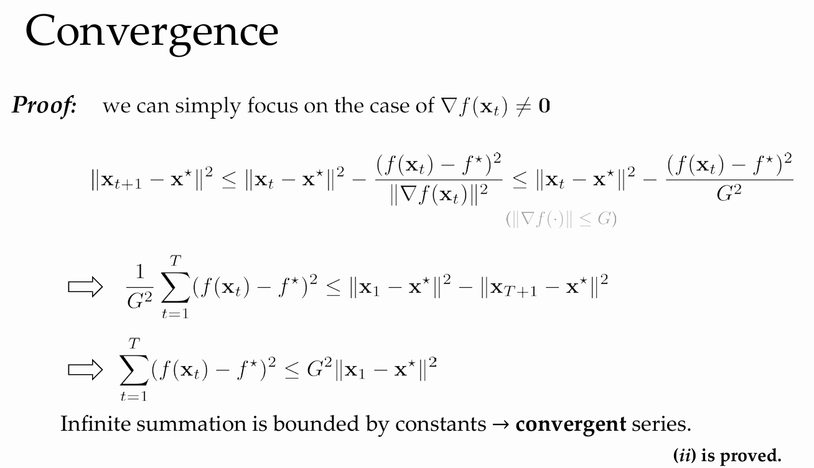
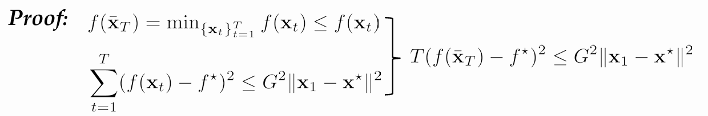
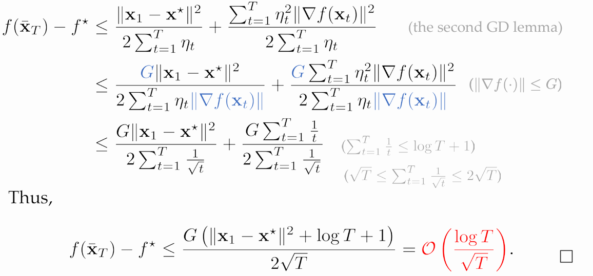
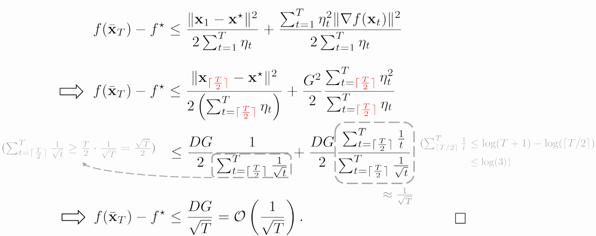
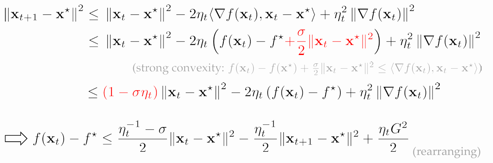
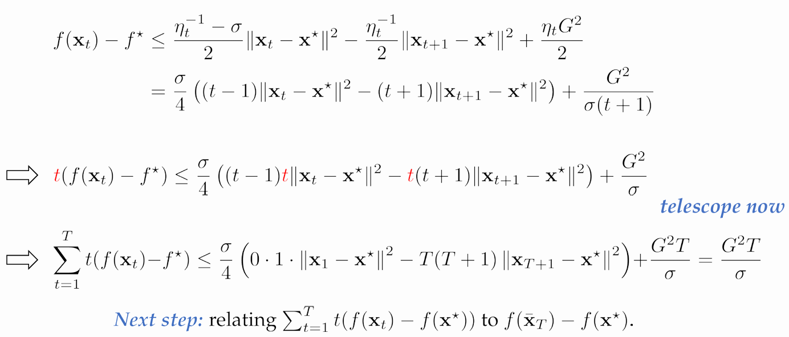
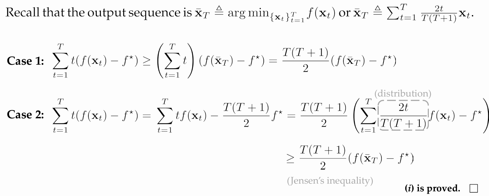
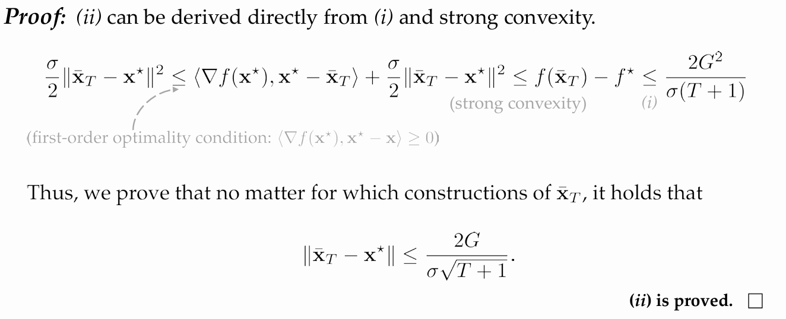
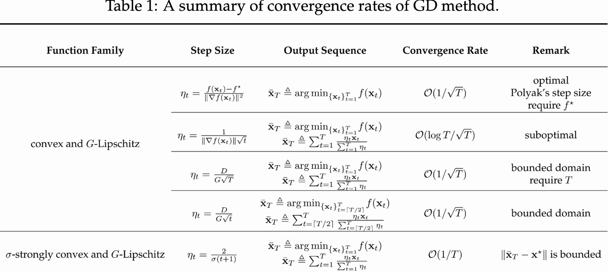
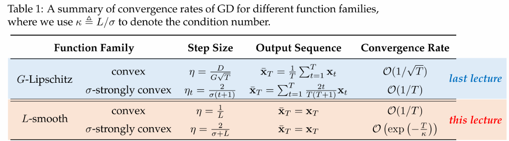

# Lecture 3. Gradient Descent Method I
# Part 1. Gradient Descent
## 凸优化问题
$$ \min f(x) \quad \text{s.t.} \quad x \in \mathcal{X} $$
- $x \in \mathcal{R}^d$
- $f: \mathcal{R}^d \to \mathcal{R}$
- $\mathcal{X}$ is a convex set
## 优化目标
序列$\{\bar{x_t}\}_{t=1}^T$,使得$\bar{x_t}$随t增长接近$x^*$
- 接近-1: $f(\bar{x_t}) - f(x^*) \leq \epsilon(T)$
- 接近-2：$\|x_t - x^*\| \leq \epsilon(T)$

## 梯度下降 Gradient Descent
- GD模板: $x_{t+1} = \Pi_x [x_t - \eta_t \nabla f(x_t)]$
  - $x_1$是domain内的任意点
  - 学习率$\eta_t \in (0, 1)$是可随时间变化的参数
- 使用梯度下降的原因
  - 找到一系列上界$u_1, ……, u_T$，使得:
  - $1:f(x_t) = U_t(x_t)$
  - $2:f(x) \leq U_t(x), \forall x \in \mathcal{X}$
  - $3:U_t(x)$ should be easy to optimize
  - 则有$x_{t+1} = argmin_{x\in \mathcal{X}} U_t(x)$
  - 若f满足:凸,可微,L-sooth,则$U_t(x) \overset{\Delta }{=} f(x_t) + <\nabla f(x_t), x - x_t> + \frac{L}{2} \|x - x_t\|_2^2$满足以上3条
  - 则$x_{t+1} = argmin_{U_t(x)} = x_t - \frac{1}{L} \nabla f(x_t) \quad or \quad \Pi_X [x_t - \frac{1}{L} \nabla f(x_t)]$

# Part2. Convex and Lipschitz
## The First Gradient Descent Lemma
**Lemma 1.** 函数 $f$ is proper, closed and convex;可行域 $\mathcal{X}$ is nonempty, closed and convex. 记 $\{x_t\}_{t=1}^T$ 为GD生成的序列, $\mathcal{X} ^*$ 为最优解集合, $f^*$ 为最优值. Then for any $x^* \in \mathcal{X} ^*$ and $t \geq 0$,

$$
\|x_{t+1} - x^*\|^2 \leq \|x_t - x^*\|^2 - 2\eta_t(f(x_t) - f^*) + \eta_t^2 \|\nabla f(x_t)\|^2.
$$

**Proof:**
$$
\begin{align*}
\|x_{t+1} - x^*\|^2 &= \|\Pi_\mathcal{X} [ x_t - \eta_t \nabla f(x_t) ]- x^*\|^2 \quad \text{(GD)} \\
&\leq \|x_t - \eta_t \nabla f(x_t) - x^*\|^2 \quad \text{(Pythagoras Theorem)} \\
&= \|x_t - x^*\|^2 - 2\eta_t(\nabla f(x_t), x_t - x^*\} + \eta_t^2 \|\nabla f(x_t)\|^2 \\
&\leq \|x_t - x^*\|^2 - 2\eta_t(f(x_t) - f^*) + \eta_t^2 \|\nabla f(x_t)\|^2 \quad \\&\text{(convexity: } f(x_t) - f^* = f(x_t) - f(x^*) \leq (\nabla f(x_t), x_t - x^*))
\end{align*}
$$

# Polyak Step Size
- 根据Lemma1,定义 $h(\eta) \overset{\Delta}{=} -2\eta(f(x_t) - f^*) + \eta^2\|\nabla f(x_t)\|^2$
- $Minimize\ h(\eta)$,取其导数为0,得到$\eta = \frac{f(x_t) - f^*}{\|\nabla f(x_t)\|^2}$
- 由凸函数性质,$\nabla f(x_t) = 0$时,$f(x_t) = f^*$,即为最优解
- $\eta_t = 
\begin{cases} 
\frac{f(x_t) - f^\star}{\|\nabla f(x_t)\|^2}, & \nabla f(x_t) \neq 0 \\ 
1, & \nabla f(x_t) = 0 
\end{cases}$
- 一维下的解释:$x_{t+1} = x_t - \eta_t \nabla f(x_t)$,假设$f^*$已知,则$\eta_t = \frac{f(x_t) - f^*}{(f'(x_t))^2}$
- Theorem1:在lemma1相同的假设下,若f的梯度不大于G,即$||\nabla f(\cdot)|| \leq G$,Polyak 步长进行梯度下降有以下性质:
  - $(1) ||x_{t+1} - x^*||^2 \leq ||x_t - x^*||^2$
  - 由Lemma1,$||x_{t+1} - x^*||^2 \leq ||x_t - x^*||^2 - 2\eta_t (f(x_t) - f^*) + \eta_t^2 \|\nabla f(x_t)\|^2$
  - Case1:$\nabla f(x_t) = 0$,由凸性,$f(x_t) = f^*$,则$||x_{t+1} - x^*||^2 = ||x_t - x^*||^2$
  - Case2:$\nabla f(x_t) \neq 0$,由Polyak步长,$\eta_t = \frac{f(x_t) - f^*}{\|\nabla f(x_t)\|^2} \Longrightarrow ||x_{t+1} - x^*||^2 \leq ||x_t - x^*||^2 - \frac{(f(x_t) - f^*)^2}{\|\nabla f(x_t)\|^2} \leq ||x_t - x^*||^2$
  - $(2) f(x_t) \rightarrow f^*$ as $t \rightarrow \infty$
  - Proof:
- Theorem2: 在与Theorem1相同的假设下,梯度下降方法使用 Polyak 步长，那么可以得到以下收敛速率：
  - $f(\bar{x}_T) - f^* \leq \frac{G ||x_1 - x^*||^2}{\sqrt{T}} = O(\frac{1}{\sqrt{T}})$
  - $f(\bar{x}_T)$是在 𝑇次迭代中，函数值$𝑓(𝑥_𝑡)$最小的点。
- 
## The First Gradient Descent Lemma

# Part 3. Convergence without Optimal Value
**Lemma2:**
- Theorem1相同的假设下,记$\{x_t\}_{t=1}^T$为梯度下降的序列,则有:
  - $\sum_{t=1}^T \eta_t (f(x_t) - f^\star) \leq \frac{1}{2} \|x_1 - x^\star\|^2 + \frac{1}{2} \sum_{t=1}^T \eta_t^2 \|\nabla f(x_t)\|^2$
  - Proof:
  - $\|x_{t+1} - x^\star\|^2 \leq \|x_t - x^\star\|^2 - 2\eta_t (f(x_t) - f^\star) + \eta_t^2 \|\nabla f(x_t)\|^2$
  - $\Longrightarrow \eta_t (f(x_t) - f^\star) \leq \frac{1}{2} \left( \|x_t - x^\star\|^2 - \|x_{t+1} - x^\star\|^2 \right) + \frac{1}{2} \eta_t^2 \|\nabla f(x_t)\|^2$
  
**Lemma3: **
- Lemma2相同条件下,$\bar{x}_T \triangleq \arg \min_{\{x_t\}_{t=1}^T} f(x_t) \quad \text{or} \quad \bar{x}_T \triangleq \frac{\sum_{t=1}^T \eta_t x_t}{\sum_{t=1}^T \eta_t}$,有:
  -  $f(\bar{x}_T) - f^\star \leq \frac{\|x_1 - x^\star\|^2}{2 \sum_{t=1}^T \eta_t} + \frac{\sum_{t=1}^T \eta_t^2 \|\nabla f(x_t)\|^2}{2 \sum_{t=1}^T \eta_t}$
  - Proof:
  - Case1,$\bar{x}_T \triangleq \arg \min_{\{x_t\}_{t=1}^T} f(x_t)$:
  - - $\sum_{t=1}^T \eta_t (f(x_t) - f^\star) \geq \left( \sum_{t=1}^T \eta_t \right) (f(\bar{x}_T) - f^\star)$
  - - $\sum_{t=1}^T \eta_t (f(x_t) - f^\star) \leq \frac{1}{2} \|x_1 - x^\star\|^2 + \frac{1}{2} \sum_{t=1}^T \eta_t^2 \|\nabla f(x_t)\|^2$
  - - $f(\bar{x}_T) - f^\star \leq \frac{\|x_1 - x^\star\|^2}{2 \sum_{t=1}^T \eta_t} + \frac{\sum_{t=1}^T \eta_t^2 \|\nabla f(x_t)\|^2}{2 \sum_{t=1}^T \eta_t}$
  - Case2,$\bar{x}_T = \frac{\sum_{t=1}^T \eta_t x_t}{\sum_{t=1}^T \eta_t}$:
  - - $\bar{x}_T = \frac{\sum_{t=1}^T \eta_t x_t}{\sum_{t=1}^T \eta_t}$
  - - $\sum_{t=1}^T \eta_t (f(x_t) - f^\star) \geq \left( \sum_{t=1}^T \eta_t \right) \left( f\left( \frac{\sum_{t=1}^T \eta_t x_t}{\sum_{t=1}^T \eta_t} \right) - f^\star \right)$
  - - $f(\bar{x}_T) - f^\star \leq \frac{\|x_1 - x^\star\|^2}{2 \sum_{t=1}^T \eta_t} + \frac{\sum_{t=1}^T \eta_t^2 \|\nabla f(x_t)\|^2}{2 \sum_{t=1}^T \eta_t}$
  
**Theorem3:**
- If $\frac{\sum_{t=1}^T \eta_t^2}{\sum_{t=1}^T \eta_t} \to 0 \quad \text{as} \quad T \to \infty,then\quad f(\bar{x}_T) \to f^\star \quad \text{as} \quad T \to \infty.$
  - Proof:$f(\bar{x}_T) - f^\star \leq \frac{\|x_1 - x^\star\|^2}{2 \sum_{t=1}^T \eta_t} + \frac{\sum_{t=1}^T \eta_t^2 \|\nabla f(x_t)\|^2}{2 \sum_{t=1}^T \eta_t} \leq \frac{\|x_1 - x^\star\|^2}{2 \sum_{t=1}^T \eta_t} + \frac{\sum_{t=1}^T \eta_t^2 G^2}{2 \sum_{t=1}^T \eta_t}$
  - 对于典型的步长$\eta_t = \frac{1}{t}$,则$\frac{\sum_{t=1}^T \eta_t^2}{\sum_{t=1}^T \eta_t} \approx \frac{log T}{\sqrt{T}} \to 0 \quad \text{as} \quad T \to \infty$
- Theorem4: $\eta_t = \frac{1}{\|\nabla f(x_t)\| \sqrt{t}}, Then \;
f(\bar{x}_T) - f^\star \leq \frac{G (\|x_1 - x^\star\|^2 + \log T + 1)}{2 \sqrt{T}} = O\left(\frac{\log T}{\sqrt{T}}\right), where \; \bar{x}_T \triangleq \arg \min_{\{x_t\}_{t=1}^T} f(x_t) \quad \text{or} \quad \bar{x}_T \triangleq \frac{\sum_{t=1}^T \eta_t x_t}{\sum_{t=1}^T \eta_t}.$
  - $f^*$未知的情况下有$O\left(\frac{\log T}{\sqrt{T}}\right)$的收敛速率
  - Proof:
  - $f(\bar{x}_T) - f^\star \leq \frac{\|x_1 - x^\star\|^2}{2 \sum_{t=1}^T \eta_t} + \frac{\sum_{t=1}^T \eta_t^2 \|\nabla f(x_t)\|^2}{2 \sum_{t=1}^T \eta_t}.$
# Part 4. Optimal in Convex and Lipschitz Case
- 最优值$f^*$未知时有较差的收敛速度$O\left(\frac{\log T}{\sqrt{T}}\right)$,可以通过引入bounded domain假设来提升
- ## Optimal Result with Known T
**Theorem5:**
- 若$\mathcal{X}$满足$\forall x,y \in \mathcal{X}, \|x - y\|_2 \leq D$,$\eta_t = \frac{D}{G \sqrt{T}}$,则有:
- $f(\bar{x}_T) - f^\star \leq \frac{DG}{\sqrt{T}} = O\left(\frac{1}{\sqrt{T}}\right).$
  - $\bar{x}_T \triangleq \arg \min_{\{x_t\}_{t=1}^T} f(x_t) \quad \text{or} \quad \bar{x}_T \triangleq \frac{1}{T} \sum_{t=1}^T x_t.$
- Proof:
  - $f(\bar{x}_T) - f^\star \leq \frac{\|x_1 - x^\star\|^2}{2 \sum_{t=1}^T \eta_t} + \frac{\sum_{t=1}^T \eta_t^2 \|\nabla f(x_t)\|^2}{2 \sum_{t=1}^T \eta_t} \leq \frac{D^2}{2 \sum_{t=1}^T \eta_t} + \frac{\sum_{t=1}^T \eta_t^2 G^2}{2 \sum_{t=1}^T \eta_t}$,代入$\eta_t = \frac{D}{G \sqrt{T}}$得证
  - $\frac{DG}{\sqrt{T}}$是凸和 Lipschitz 连续函数的最优速率。
  - 局限性:需要提前知道总迭代次数T
- ## Optimal Result with UnKnown T
**Theorem6:**
- $\eta_t = \frac{D}{G \sqrt{t}}.,f(\bar{x}_T) - f^\star \leq \frac{DG}{\sqrt{T}} = O\left(\frac{1}{\sqrt{T}}\right).,\bar{x}_T \triangleq \arg \min_{\{x_t\}_{t=\lceil T/2 \rceil}^T} f(x_t) \quad \text{or} \quad \bar{x}_T \triangleq \frac{\sum_{t=\lceil T/2 \rceil}^T \eta_t x_t}{\sum_{t=\lceil T/2 \rceil}^T \eta_t}.$
- Proof: 
# Part 5. Strongly Convex and Lipschitz
## Strong Convexity
- 若f为$\sigma-strongly\ convex$，$\eta_t = \frac{2}{\sigma (t+1)}.$则有:
- $(1)\quad f(\bar{x}_T) - f^\star \leq \frac{2G^2}{\sigma (T + 1)} = O\left(\frac{1}{T}\right),
\quad \bar{x}_T \triangleq \arg \min_{\{x_t\}_{t=1}^T} f(x_t) \quad \text{or} \quad \bar{x}_T \triangleq \sum_{t=1}^T \frac{2t}{T(T + 1)} x_t.$
- $(2) \quad \|\bar{x}_T - x^\star\| \leq \frac{2G}{\sigma \sqrt{T + 1}}.$
- Proof:
$$
\begin{align*}
\|x_{t+1} - x^\star\|^2 &\leq \|x_t - x^\star\|^2 - 2 \eta_t \langle \nabla f(x_t), x_t - x^\star \rangle + \eta_t^2 \|\nabla f(x_t)\|^2\\
&\leq \|x_t - x^\star\|^2 - 2 \eta_t \left( f(x_t) - f^\star + \frac{\sigma}{2} \|x_t - x^\star\|^2 \right) + \eta_t^2 \|\nabla f(x_t)\|^2\\
&\leq (1 - \sigma \eta_t) \|x_t - x^\star\|^2 - 2 \eta_t (f(x_t) - f^\star) + \eta_t^2 G^2.
\end{align*}
$$
- $f(x_t) - f^\star \leq \frac{\eta_t^{-1} - \sigma}{2} \|x_t - x^\star\|^2 - \frac{\eta_t^{-1}}{2} \|x_{t+1} - x^\star\|^2 + \frac{\eta_t G^2}{2}.$
- 
- 
- 
- 

# Summary
- 
- 

