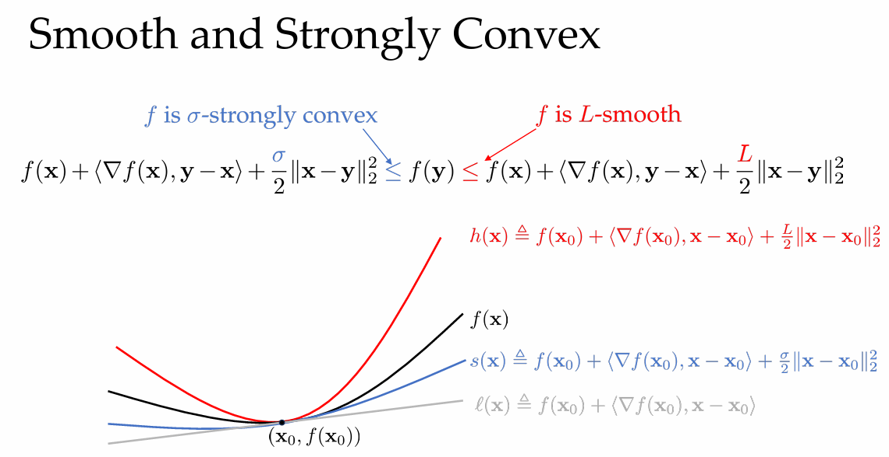
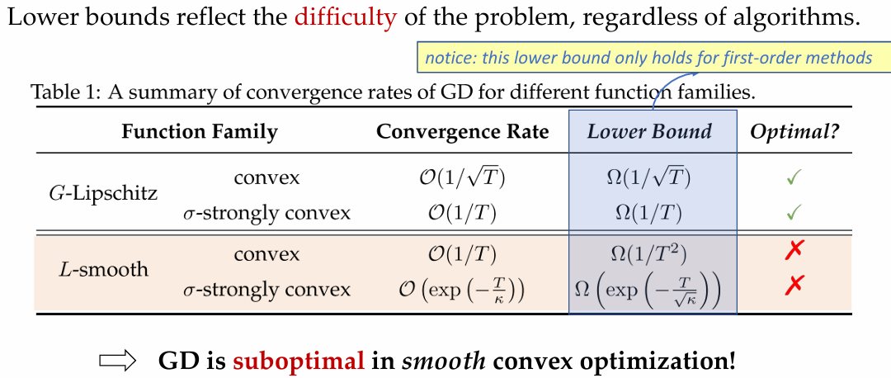
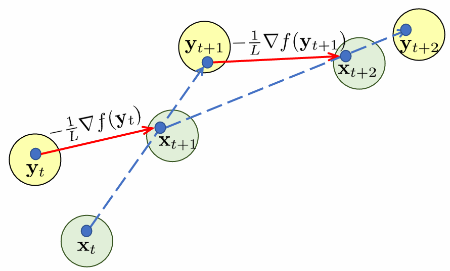
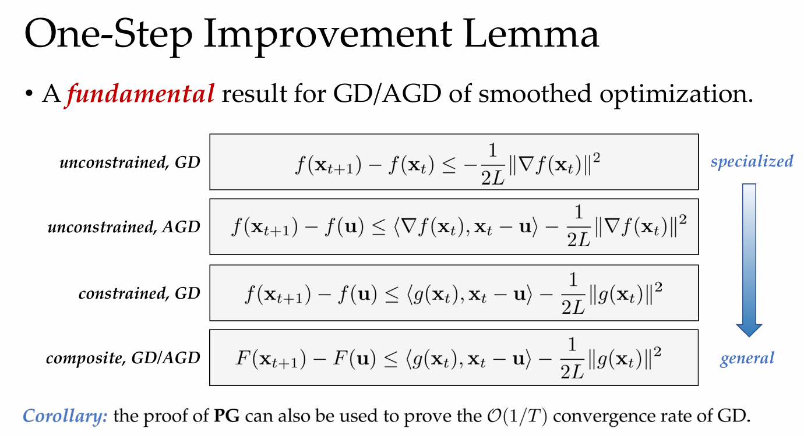
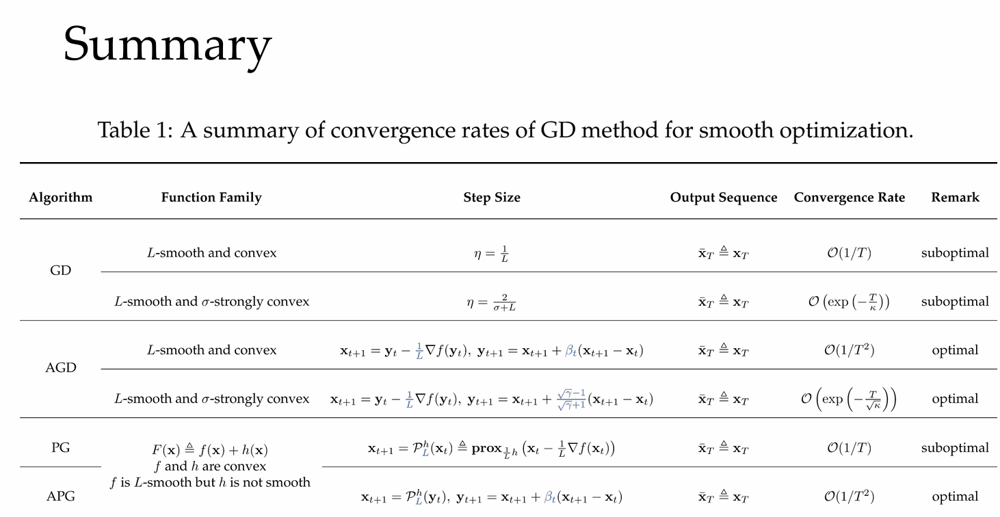

# Lecture 4. Gradient Descent Method II
# Part 1. GD for Smooth Optimization
**Theorem1:**
- 函数 $f : \mathbb{R}^d \to \mathbb{R}$ is convex, differentiable, and L-smooth. GD: $x_{t+1} = x_t - \eta_t \nabla f(x_t)$ 以步长 $\eta_t = \frac{1}{L}$更新时, GD 有如下收敛保证:

$$
f(x_T) - f(x^*) \leq \frac{2L \|x_1 - x^*\|^2}{T - 1} = \mathcal{O}\left(\frac{1}{T}\right).
$$

**Lemma 1**.[详见chap3]
- 函数 f is proper, closed and convex; 可行域 $\chi$ is nonempty,closed and convex.
- 记 $\{x_t\}_{t=1}^T$ 为GD生成的序列, $x^*$ 为最优解集合, $f^*$ 为最优值. Then for any $x^* \in X^*$ and $t \geq 0$,
$$\|\mathbf{x}_{t+1}-\mathbf{x}^\star\|^2\leq\|\mathbf{x}_t-\mathbf{x}^\star\|^2-2\eta_t(f(\mathbf{x}_t)-f^\star)+\eta_t^2\|\nabla f(\mathbf{x}_t)\|^2.$$
- Proof：
$$\begin{align*}\left\|\mathrm{x}_{t+1}-\mathrm{x}^{\star}\right\|^{2}&=\left\|\Pi_{\mathcal{X}}[\mathbf{x}_{t}-\eta_{t}\nabla f(\mathbf{x}_{t})\right]-\mathbf{x}^{\star}\|^{2}\text{(GD)}\\&\leq\left\|\mathbf{x}_{t}-\eta_{t}\nabla f(\mathbf{x}_{t})-\mathbf{x}^{\star}\right\|^{2}\text{(Pythagoras Theorem)}\\&=\left\|\mathbf{x}_{t}-\mathbf{x}^{\star}\right\|^{2}-2\eta_{t}\left\langle\nabla f(\mathbf{x}_{t}),\mathbf{x}_{t}-\mathbf{x}^{\star}\right\rangle+\eta_{t}^{2}\left\|\nabla f(\mathbf{x}_{t})\right\|^{2}\\&\leq\left\|\mathbf{x}_{t}-\mathbf{x}^{\star}\right\|^{2}-2\eta_{t}\left(f(\mathbf{x}_{t})-f^{\star}\right)+\eta_{t}^{2}\left\|\nabla f(\mathbf{x}_{t})\right\|^{2}\\&(\text{convexity: }f(\mathbf{x}_{t})-f^{\star}=f(\mathbf{x}_{t})-f(\mathbf{x}^{\star})\leq\langle\nabla f(\mathbf{x}_{t}),\mathbf{x}_{t}-\mathbf{x}^{\star}\rangle)\quad\square\end{align*}$$
- 注意到,此处 $2\eta_{t}\left(f(\mathbf{x}_{t})-f^{\star}\right)$ 的推导只使用了凸性而没有使用smoothness。
  
**使用smoothness**
$$
\begin{align*}
\Rightarrow \|\mathbf{x}_{t+1} - \mathbf{x}^{\star}\|^2 &\leq \|\mathbf{x}_{t} - \mathbf{x}^{\star}\|^2 + \left(\eta_t^2 - \frac{2 \eta_t}{L}\right) \|\nabla f(\mathbf{x}_{t})\|^2 \\
(co-coercivity:\langle \nabla f(\mathbf{x}_t), \mathbf{x}_t - \mathbf{x}^{\star} \rangle &= \langle \nabla f(\mathbf{x}_t) - \nabla f(\mathbf{x}^{\star}), \mathbf{x}_t - \mathbf{x}^{\star} \rangle \geq \frac{1}{L} \|\nabla f(\mathbf{x}_t) - \nabla f(\mathbf{x}^{\star})\|^2 = \frac{1}{L} \|\nabla f(\mathbf{x}_t)\|^2)\\
&\leq \|\mathbf{x}_{t} - \mathbf{x}^{\star}\|^2 - \frac{1}{L^2} \|\nabla f(\mathbf{x}_{t})\|^2\quad(pick\ \eta_t = \frac{1}{L})\\
&\leq \|\mathbf{x}_{t} - \mathbf{x}^{\star}\|^2 \leq \dots \leq \|\mathbf{x}_{1} - \mathbf{x}^{\star}\|^2
\end{align*}
$$
**Lemma 2(co-coercivity)**.
$$\begin{aligned}&\text{Let f be convex and L-smooth over }\mathbb{R}^d.\textit{ Then for all}&\mathbf{x},\mathbf{y}\in\mathbb{R}^d,\textit{one has}\\&\langle\nabla f(\mathbf{x})-\nabla f(\mathbf{y}),\mathbf{x}-\mathbf{y}\rangle\geq\frac1L\|\nabla f(\mathbf{x})-\nabla f(\mathbf{y})\|^2\end{aligned}$$
- 证明可见 https://zhuanlan.zhihu.com/p/141927810

**Definition 1 (co-coercive operator)**. 

若对任意$x,y\in\mathcal{H}$,
$$\langle Cx-Cy,x-y\rangle\geq\beta\|Cx-Cy\|^2.$$
则称算子$C$为 $\beta$-co-coercive (或 $\beta-inverse-strongly$ monotone), 其中$\beta>0$

**函数值层面的Lemma1**.
- 
$$\begin{align*}
f(\mathbf{x}_{t+1}) - f(\mathbf{x}^{\star}) &= f(\mathbf{x}_{t+1}) - f(\mathbf{x}_t) + f(\mathbf{x}_t) - f(\mathbf{x}^{\star}) \\
f(\mathbf{x}_{t+1}) - f(\mathbf{x}_{t})&\overset{无约束}= \left( f(\mathbf{x}_t - \eta_t \nabla f(\mathbf{x}_t)) - f(\mathbf{x}_t) \right) \\
&\leq \langle \nabla f(\mathbf{x}_t), -\eta_t \nabla f(\mathbf{x}_t) \rangle + \frac{L}{2} \eta_t^2 \|\nabla f(\mathbf{x}_t)\|^2 \quad \text{(smoothness)} \\
&= \left( -\eta_t + \frac{L}{2} \eta_t^2 \right) \|\nabla f(\mathbf{x}_t)\|^2 \\
&= -\frac{1}{2L} \|\nabla f(\mathbf{x}_t)\|^2 \quad \text{(pick } \eta_t = \eta = \frac{1}{L} \text{)} \\
&\text{Caution: This derivation doesn't require convexity!}
\end{align*}
$$
$$\implies f(\mathbf{x}_{t+1}) - f(\mathbf{x}^{\star}) \leq -\frac{1}{2L} \|\nabla f(\mathbf{x}_t)\|^2 + f(\mathbf{x}_t) - f(\mathbf{x}^{\star})$$

$$\begin{align*}
f(\mathbf{x}_t) - f(\mathbf{x}^{\star}) &\leq \langle \nabla f(\mathbf{x}_t), \mathbf{x}_t - \mathbf{x}^{\star} \rangle 
\leq \|\nabla f(\mathbf{x}_t)\| \|\mathbf{x}_t - \mathbf{x}^{\star}\| \\
&\Rightarrow \|\nabla f(\mathbf{x}_t)\|^2 \geq \frac{(f(\mathbf{x}_t) - f(\mathbf{x}^{\star}))^2}{\|\mathbf{x}_t - \mathbf{x}^{\star}\|^2}
\end{align*}
$$
$$\begin{aligned}
\implies f(\mathbf{x}_{t+1})-f(\mathbf{x}^{\star})& \leq -\frac{(f(\mathbf{x}_t)-f(\mathbf{x}^\star))^2}{2L\left\|\mathbf{x}_t-\mathbf{x}^\star\right\|^2}+f(\mathbf{x}_t)-f(\mathbf{x}^\star) \\
&\leq-\frac{(f(\mathbf{x}_t)-f(\mathbf{x}^\star))^2}{2L\left\|\mathbf{x}_1-\mathbf{x}^\star\right\|^2}+f(\mathbf{x}_t)-f(\mathbf{x}^\star)
\end{aligned}$$

$$
\begin{aligned}
&Define \; \delta_t \triangleq f(\mathbf{x}_t) - f(\mathbf{x}^{\star})\; and \;\beta \triangleq \frac{1}{2L \|\mathbf{x}_1 - \mathbf{x}^{\star}\|^2}\\
&\Rightarrow \delta_{t+1} \leq \delta_t - \beta \delta_t^2\\
&\Rightarrow \frac{1}{\delta_t} \leq \frac{1}{\delta_{t+1}} - \beta \frac{\delta_t}{\delta_{t+1}} \leq \frac{1}{\delta_{t+1}} - \beta \quad \\
&\sum_{t=1}^{T-1} \beta \leq \frac{1}{\delta_T} - \frac{1}{\delta_1} \leq \frac{1}{\delta_T}\\

&\delta_T \triangleq f(\mathbf{x}_T) - f(\mathbf{x}^{\star}) 
\leq \frac{1}{\beta (T-1)} = \frac{2L \|\mathbf{x}_1 - \mathbf{x}^{\star}\|^2}{T - 1}.
\end{aligned}
$$

## Key Lemma for Smooth GD

- **smooth optimization** : *one-step improvement*.

   $
  f(\mathbf{x}_{t+1}) - f(\mathbf{x}_t) \leq \left( -\eta_t + \frac{L}{2} \eta_t^2 \right) \|\nabla f(\mathbf{x}_t)\|^2 \Rightarrow f(\mathbf{x}_T) - f(\mathbf{x}^{\star}) \leq \mathcal{O} \left( \frac{1}{T} \right).
  $
  - 最后一次迭代的结果

- Compare a similar result that holds for **convex** and **Lipschitz** functions.[Chap 3]

  > **Lemma 2.** 
  -  $f(\bar{x}_T) - f^\star \leq \frac{\|x_1 - x^\star\|^2}{2 \sum_{t=1}^T \eta_t} + \frac{\sum_{t=1}^T \eta_t^2 \|\nabla f(x_t)\|^2}{2 \sum_{t=1}^T \eta_t}$  
  - 平均迭代结果

## One-Step Improvement Lemma for Smooth GD
**Lemma 3 (one-step improvement)**. 

函数$f : \mathbb{R}^d \rightarrow \mathbb{R}$ 凸、可微、$L$-smooth. 考虑无约束GD update: $\mathbf{x}' = \mathbf{x} - \eta \nabla f(\mathbf{x})$. 有,

$f(\mathbf{x}') - f(\mathbf{x}) \leq \left( -\eta + \frac{L}{2} \eta^2 \right) \|\nabla f(\mathbf{x})\|^2.$

选取$\eta = \frac{1}{L}$, 则有

$f \left( \mathbf{x} - \frac{1}{L} \nabla f(\mathbf{x}) \right) - f(\mathbf{x}) \leq -\frac{1}{2L} \|\nabla f(\mathbf{x})\|^2.$

函数值下降速度与梯度平方成正比.*(consider due reasons)*.

**Lemma 4 (co-coercivity of smooth and strongly convex function).** 
- 同时利用smoothness和strong convexity的性质
- 设$f$为$\mathbb{R} ^d$上的 L-smooth and σ-strongly convex 函数 . 则对任意$\mathbf{x} , \mathbf{y} \in \mathbb{R} ^d$, 满足

$$\langle\nabla f(\mathbf{x})-\nabla f(\mathbf{y}),\mathbf{x}-\mathbf{y}\rangle\geq\frac{\sigma L}{\sigma+L}\|\mathbf{x}-\mathbf{y}\|^2+\frac1{\sigma+L}\|\nabla f(\mathbf{x})-\nabla f(\mathbf{y})\|^2.$$

$\boldsymbol{Proof:}$ Define $h(\mathbf{x})\triangleq f(\mathbf{x})-\frac\sigma2\|\mathbf{x}\|^2.$ 则有:
- - $h$ is convex: 由$\sigma$-强凸性. 
- - $h$ is $(L-\sigma)$-smooth. $\nabla^2h(\mathbf{x})=\nabla^2f(\mathbf{x})-\sigma I\preceq(L-\sigma)I.$

$$\overset{co-coercivity \; of \;smooth\; and\; convex}{\Longrightarrow}\langle\nabla h(\mathbf{x})-\nabla h(\mathbf{y}),\mathbf{x}-\mathbf{y}\rangle\geq\frac1{L-\sigma}\|
\nabla h(\mathbf{x})-\nabla h(\mathbf{y})\|^2$$

代入$h(\mathbf{x})$的定义,得证Lemma 4.

**同时利用smooth和strong convexity的性质 serving as the “one-step improvement”**.

$$\begin{align*}\left\|\mathrm{x}_{t+1}-\mathrm{x}^{\star}\right\|^{2}
&\leq\left\|\mathbf{x}_{t}-\mathbf{x}^{\star}\right\|^{2}-2\eta_{t}\left\langle\nabla f(\mathbf{x}_{t}),\mathbf{x}_{t}-\mathbf{x}^{\star}\right\rangle+\eta_{t}^{2}\left\|\nabla f(\mathbf{x}_{t})\right\|^{2}\\
&\leq \left(1-\frac{2\eta_t\sigma L}{L+\sigma}\right)\left\|\mathrm{x}_t-\mathrm{x}^\star\right\|^2+\left(\eta_t^2-\frac{2\eta_t}{L+\sigma}\right)\left\|\nabla f(\mathbf{x}_t)\right\|^2 \\
&(\nabla f(\mathbf{x}_{t}),\mathrm{x}_{t}-\mathrm{x}^{\star}\rangle=\langle\nabla f(\mathrm{x}_{t})-\nabla f(\mathrm{x}^{\star}),\mathrm{x}_{t}-\mathrm{x}^{\star}\rangle\geq\frac{1}{L+\sigma}\left\|\nabla f(\mathrm{x}_{t})\right\|^{2}+\frac{L\sigma}{L+\sigma}\left\|\mathrm{x}_{t}-\mathrm{x}^{\star}\right\|^{2})\end{align*}$$
- 步长选取目标: $(1-\frac{2\eta_t\sigma L}{L+\sigma}) < 1$ and $(\eta_t^2-\frac{2\eta_t}{L+\sigma}) \leq 0$.
- 取$\eta_t=\eta=\frac{2}{L+\sigma}$, 则有
$$\begin{aligned}&\left\|\mathrm{x}_{t+1}-\mathrm{x}^{\star}\right\|^{2}\leq\left(1-\frac{4\sigma L}{(L+\sigma)^{2}}\right)\left\|\mathrm{x}_{t}-\mathrm{x}^{\star}\right\|^{2}=\left(\frac{L-\sigma}{L+\sigma}\right)^{2}\left\|\mathrm{x}_{t}-\mathrm{x}^{\star}\right\|^{2}=\left(\frac{\kappa-1}{\kappa+1}\right)^{2}\left\|\mathrm{x}_{t}-\mathrm{x}^{\star}\right\|^{2}\\
&\Longrightarrow\left\|\mathrm{x}_{T}-\mathrm{x}^{\star}\right\|^{2}\leq\left(\frac{\kappa-1}{\kappa+1}\right)^{2(T-1)}\left\|\mathrm{x}_{1}-\mathrm{x}^{\star}\right\|^{2}\overset{(1+a)^x \leq e^{ax}}{\leq}\exp\left(-\frac{4(T-1)}{\kappa+1}\right)\left\|\mathrm{x}_{1}-\mathrm{x}^{\star}\right\|^{2}\end{aligned}$$
**函数值层面** $\colon\mathrm{relating} \; \|\mathbf{x}_{T}-\mathbf{x}^{\star}\|^{2}\; \mathrm{to}\; f(\mathbf{x}_{T})-f(\mathbf{x}^{\star}).$
$$f(\mathbf{x}_{t})\leq f(\mathbf{x}^{\star})+\langle\nabla f(\mathbf{x}^{\star}),\mathbf{x}_{t}-\mathbf{x}^{\star}\rangle+\frac{L}{2}\|\mathbf{x}_{t}-\mathbf{x}^{\star}\|^{2}=f(\mathbf{x}^{\star})+\frac{L}{2}\|\mathbf{x}_{t}-\mathbf{x}^{\star}\|^{2}\\(\text{in unconstrained case, }\nabla f(\mathbf{x}^{\star})=0)\\\implies f(\mathbf{x}_{T})-f(\mathbf{x}^{\star})\leq\frac{L}{2}\exp\left(-\frac{4(T-1)}{\kappa+1}\right)\|\mathbf{x}_{1}-\mathbf{x}^{\star}\|^{2}=\mathcal{O}\left(\exp\left(-\frac{T}{\kappa}\right)\right).$$

**Lemma 5: A generalized one-step improvement for constrained optimization**

设 f 为 L- smooth, $\mathbf{x} _{t+ 1}= \Pi _{\mathcal{X} }[ \mathbf{x} _t- \frac 1L\nabla f( \mathbf{x} _t) ]$ , and define
$g(\mathbf{x})=L(\mathbf{x}-\mathbf{x}_{t+1})$ for any $\mathbf{x}\in\mathcal{X}.$ 

则对任意 $\mathbf{u}\in\mathcal{X} 有:$

$$f(\mathbf{x}_{t+1})-f(\mathbf{u})\leq\langle g(\mathbf{x}_t),\mathbf{x}_t-\mathbf{u}\rangle-\frac{1}{2L}\|g(\mathbf{x}_t)\|^2.$$

- $g(\mathbf{x}_t)$ 被用来衡量进展; 无约束情况下相当于梯度, $g(\mathbf{x}_t)=\nabla f(\mathbf{x}_t).$
- comparator u is introduced because (projected) GD is not necessary "descent".

## Lower Bound
- 

# Part 2. Momentum and Acceleration
## Polyak’s Momentum
- GD: 
- - $\mathbf{x}_{t+1}=\mathbf{x}_t-\eta_t\nabla f(\mathbf{x}_t)$
- - 如果选取大步长,会在高曲率区域(梯度大)震荡; 小步长则会在低曲率区域(梯度小)收敛缓慢.
- GD with momentum: 
- - $\begin{aligned}\mathbf{x}_{t+1}&=\mathbf{x}_t-\eta\nabla f(\mathbf{x}_t)+\beta(\mathbf{x}_t-\mathbf{x}_{t-1})\\ &= (GD update) + (momentum)\end{aligned}$
- - 其中$\beta$为[0,1]之间的超参数.
- - 当$\beta=0$时, 退化为GD; 当$\beta=1$时, 退化为SGD.(?)
- - 如果当前梯度方向与前一步方向一致，动量会“加速”，使优化更快。
- - 如果当前梯度方向与前一步方向相反，动量会“减速”，避免振荡。

### Polyak’s Momentum的优点
- 对于二次函数,可以证明达到更快的优化收敛速度。
- - 对于更一般的函数（如光滑或强凸函数），加速效果可能不明显。
- 有助于跳出局部区域(对于非凸问题)

## Nesterov’s Accelerated GD [AGD]

$x_{t+1} = y_t - \frac{1}{L} \nabla f(y_t)$

$y_{t+1} = x_{t+1} + \beta_t (x_{t+1} - x_t)$

- $x_1 = y_1$.
- 梯度在预估位置$y_t$处计算，而不是在当前位置$x_t$处。使得优化更具前瞻性。

## Smooth and Convex

**Theorem 3.**
- 对无约束的情况

f 为 convex and L-smooth. Nesterov's accelerated GD被设置为:

$$\mathbf{x}_{t+1}=\mathbf{y}_t-\frac1L\nabla f(\mathbf{y}_t),\quad\mathbf{y}_{t+1}=\mathbf{x}_{t+1}+\beta_t(\mathbf{x}_{t+1}-\mathbf{x}_t),$$

where $\lambda _0= 0, \lambda _t= \frac {1+ \sqrt {1+ 4\lambda _{t- 1}^2}}2, and$ $\beta _t= \frac {\lambda _t- 1}{\lambda _{t+ 1}}. Then, we$ have

$$f(\mathbf{x}_T)-f(\mathbf{x}^\star)\leq\frac{2L\|\mathbf{x}_1-\mathbf{x}^\star\|^2}{T^2}=\mathcal{O}\left(\frac1{T^2}\right).$$

**Lemma 6.**
$$\begin{aligned}\textbf{对任意} u&\in\mathcal{X},if \; \mathbf{x}'=\mathbf{x}-\frac1L\nabla f(\mathbf{x}_t), \textbf{则有}:\\&f(\mathbf{x}')-f(\mathbf{u})\leq\langle\nabla f(\mathbf{x}),\mathbf{x}-\mathbf{u}\rangle-\frac1{2L}\|\nabla f(\mathbf{x})\|^2.\end{aligned}$$

$$\begin{aligned}
\textbf{Proof of Lemma6:} \\
&f(\mathbf{x}_{t+1})-f(\mathbf{u})\\&=f(\mathbf{x}_{t+1})-f(\mathbf{x}_t)+f(\mathbf{x}_t)-f(\mathbf{u}) \\
&\leq\langle\nabla f(\mathbf{x}_t),\mathbf{x}_{t+1}-\mathbf{x}_t\rangle+\frac L2\|\mathbf{x}_{t+1}-\mathbf{x}_t\|^2+\langle\nabla f(\mathbf{x}_t),\mathbf{x}_t-\mathbf{u}\rangle\quad{\text{(smoothness and convexity)}} \\
&=\langle\nabla f(\mathbf{x}_t),\mathbf{x}_{t+1}-\mathbf{u}\rangle+\frac1{2L}\|\nabla f(\mathbf{x}_t)\|\quad{(\mathbf{x}_{t+1}=\mathbf{x}_t-\frac1L\nabla f(\mathbf{x}_t))}^2 \\
&=\langle\nabla f(\mathbf{x}_t),\mathbf{x}_t-\mathbf{u}\rangle-\frac{1}{2L}\|\nabla f(\mathbf{x}_t)\|^2
\end{aligned}$$

代入$x' = x_{t+1}, x = y_t$，满足$\mathbf{x}'=\mathbf{x}-\frac1L\nabla f(\mathbf{x}_t)$.
$$
\begin{aligned}\text{(i) Plugging in u}&=\mathbf{x}_t\colon f(\mathbf{x}_{t+1})-f(\mathbf{x}_t)\leq\langle\nabla f(\mathbf{y}_t),\mathbf{y}_t-\mathbf{x}_t\rangle-\frac{1}{2L}\|\nabla f(\mathbf{y}_t)\|^2.\\\text{(ii) Plugging in u}&=\mathbf{x}^\star\colon f(\mathbf{x}_{t+1})-f(\mathbf{x}^\star)\leq\langle\nabla f(\mathbf{y}_t),\mathbf{y}_t-\mathbf{x}^\star\rangle-\frac{1}{2L}\|\nabla f(\mathbf{y}_t)\|^2.\end{aligned}
$$

- Requirements
$$\begin{aligned}
\textbf{Requirement (1):}& \quad \lambda_t (\lambda_t - 1) = \lambda_{t-1}^2 \quad 
\Rightarrow \quad \lambda_t = \frac{1 + \sqrt{1 + 4\lambda_{t-1}^2}}{2}\\
\textbf{Requirement (2):}& \quad \lambda_t \mathbf{x}_{t+1} - (\lambda_t - 1)\mathbf{x}_t = 
\lambda_{t+1} \mathbf{y}_{t+1} - (\lambda_t - 1)\mathbf{x}_{t+1}\\
&\quad \Rightarrow \quad 
\mathbf{y}_{t+1} = \mathbf{x}_{t+1} + \frac{\lambda_t - 1}{\lambda_{t+1}}
(\mathbf{x}_{t+1} - \mathbf{x}_t) 
\quad \Rightarrow \quad 
\beta_t = \frac{\lambda_t - 1}{\lambda_{t+1}}\\
\textbf{Requirement (3):}& \quad \lambda_0 = 0\\
\textbf{Requirement (4):}& \quad \mathbf{y}_1 = \mathbf{x}_1\\
\end{aligned}
$$

$\textbf{Goal: design a telescoping series}$

$(\lambda_t - 1)(i) + (ii):$

- 左式 LHS:
$$
\begin{aligned}
&(\lambda_t - 1)\big(f(\mathbf{x}_{t+1}) - f(\mathbf{x}_t)\big) + f(\mathbf{x}_{t+1}) - f(\mathbf{x}^\star)\\
&= \lambda_t\big(f(\mathbf{x}_{t+1}) - f(\mathbf{x}^\star)\big) - (\lambda_t - 1)\big(f(\mathbf{x}_t) - f(\mathbf{x}^\star)\big)\\
&\overset{\delta_t \triangleq f(\mathbf{x}_t) - f(\mathbf{x}^\star)}{=} \lambda_t \delta_{t+1} - (\lambda_t - 1)\delta_t\\
\end{aligned}
$$

- 右式 RHS:

$$
(\lambda_t - 1) \left( \langle \nabla f(\mathbf{y}_t), \mathbf{y}_t - \mathbf{x}_t \rangle 
- \frac{1}{2L} \|\nabla f(\mathbf{y}_t)\|^2 \right)
+ \langle \nabla f(\mathbf{y}_t), \mathbf{y}_t - \mathbf{x}^\star \rangle
- \frac{1}{2L} \|\nabla f(\mathbf{y}_t)\|^2
$$
$$
= \langle \nabla f(\mathbf{y}_t), \lambda_t \mathbf{y}_t - (\lambda_t - 1)\mathbf{x}_t - \mathbf{x}^\star \rangle 
- \frac{\lambda_t}{2L} \|\nabla f(\mathbf{y}_t)\|^2
$$

- 合并左式与右式

$$\lambda_t \delta_{t+1} - (\lambda_t - 1)\delta_t 
\leq \langle \nabla f(\mathbf{y}_t), \lambda_t \mathbf{y}_t - (\lambda_t - 1)\mathbf{x}_t - \mathbf{x}^\star \rangle 
- \frac{\lambda_t}{2L} \|\nabla f(\mathbf{y}_t)\|^2$$

$$\Rightarrow \lambda_t^2 \delta_{t+1} - \lambda_t(\lambda_t - 1)\delta_t 
\leq \frac{1}{2L} \left( 2 \langle \lambda_t \nabla f(\mathbf{y}_t), L(\lambda_t \mathbf{y}_t - (\lambda_t - 1)\mathbf{x}_t - \mathbf{x}^\star) \rangle 
- \|\lambda_t \nabla f(\mathbf{y}_t)\|^2 \right)[mult. \lambda_t]$$

$$\begin{aligned}
\Rightarrow \lambda_t^2 \delta_{t+1} - \lambda_{t-1}^2 \delta_t 
&\leq \frac{1}{2L} \left( 2 \langle \lambda_t \nabla f(\mathbf{y}_t), L(\lambda_t \mathbf{y}_t - (\lambda_t - 1)\mathbf{x}_t - \mathbf{x}^\star) \rangle 
- \|\lambda_t \nabla f(\mathbf{y}_t)\|^2 \right)[Requirement (1)]\\

&\leq \frac{1}{2L} \left( 2 \langle \mathbf{a}, \mathbf{b} \rangle - \|\mathbf{a}\|^2 \right) 
\leq \frac{1}{2L} \left( 2 ||a||\cdot||b|| - \|\mathbf{a}\|^2 \right)
= \frac{1}{2L} \left( \|\mathbf{b}\|^2 - \|\mathbf{b} - \mathbf{a}\|^2 \right)\\

&= \frac{1}{2L} \left( L^2 \|\lambda_t \mathbf{y}_t - (\lambda_t - 1)\mathbf{x}_t - \mathbf{x}^\star\|^2 
- \|L (\lambda_t \mathbf{y}_t - (\lambda_t - 1)\mathbf{x}_t - \mathbf{x}^\star) - \lambda_t \nabla f(\mathbf{y}_t)\|^2 \right)\\

&= \frac{L}{2} \left( \|\lambda_t \mathbf{y}_t - (\lambda_t - 1)\mathbf{x}_t - \mathbf{x}^\star\|^2 
- \left\| \lambda_t \mathbf{y}_t - (\lambda_t - 1)\mathbf{x}_t - \mathbf{x}^\star 
- \frac{\lambda_t \nabla f(\mathbf{y}_t)}{L} \right\|^2 \right)\\

&= \frac{L}{2} \left( \|\lambda_t \mathbf{y}_t - (\lambda_t - 1)\mathbf{x}_t - \mathbf{x}^\star\|^2 
- \|\lambda_t \mathbf{x}_{t+1} - (\lambda_t - 1)\mathbf{x}_t - \mathbf{x}^\star\|^2 \right)\;[x_{t+1} = y_t - \frac{1}{L} \nabla f(y_t)]\\

&= \frac{L}{2} \left( \|\lambda_t \mathbf{y}_t - (\lambda_t - 1)\mathbf{x}_t - \mathbf{x}^\star\|^2 - \|\lambda_{t+1} \mathbf{y}_{t+1} - (\lambda_{t+1} - 1)\mathbf{x}_{t+1} - \mathbf{x}^\star\|^2 \right) [Requirement (2)]\\

& = \frac{L}{2} \left( \|\mathbf{z}_t\|^2 - \|\mathbf{z}_{t+1}\|^2 \right)

\end{aligned}
$$

$
\Rightarrow \lambda_{T-1}^2 \delta_T - \lambda_0^2 \delta_1 \;
= \frac{L}{2} \left( \|\mathbf{z}_1\|^2 - \|\mathbf{z}_T\|^2 \right)
$

$$
\begin{aligned}
\Rightarrow \quad \delta_T \leq \frac{L \|\mathbf{z}_1\|^2}{2\lambda_{T-1}^2} 
&= \frac{L \|\lambda_1 \mathbf{y}_1 - (\lambda_1 - 1) \mathbf{x}_1 - \mathbf{x}^\star\|^2}{2\lambda_{T-1}^2} \; [Requirement (3)]\\

&= \frac{L \|\mathbf{x}_1 - \mathbf{x}^\star\|^2}{2\lambda_{T-1}^2} \; [Requirement (4)]
\end{aligned}
$$

$$where \; \mathbf{a} \triangleq \lambda_t \nabla f(\mathbf{y}_t), \quad 
\mathbf{b} \triangleq L (\lambda_t \mathbf{y}_t - (\lambda_t - 1)\mathbf{x}_t - \mathbf{x}^\star),\\ \mathbf{z}_t \triangleq \lambda_t \mathbf{y}_t - (\lambda_t - 1)\mathbf{x}_t - \mathbf{x}^\star$$

## Smooth and Strongly Convex
**Theorem 4.**

若 f 为 σ-strongly convex and L-smooth, 以如下方式进行 Nesterov's accelerated gradient descent:

$$\mathbf{x}_{t+1}=\mathbf{y}_t-\dfrac{1}{L}\nabla f(\mathbf{y}_t),\quad\mathbf{y}_{t+1}=\mathbf{x}_{t+1}+\dfrac{\sqrt{\gamma}-1}{\sqrt{\gamma}+1}(\mathbf{x}_{t+1}-\mathbf{x}_t)$$

满足

$$f(\mathbf{x}_T)-f(\mathbf{x}^\star)\leq\frac{\sigma+L}{2}\left\|\mathbf{x}^\star-\mathbf{y}_1\right\|^2\exp\left(-\frac{T}{\sqrt{\gamma}}\right),$$

其中 $\gamma\triangleq L/\sigma$ denotes the condition number.

# Part 3. Extension to Composite Optimization

## Composite Optimization [复合优化]
**问题设置:**
$$
\min_{\mathbf{x} \in \mathbb{R}^d} F(\mathbf{x}) \triangleq f(\mathbf{x}) + h(\mathbf{x})
$$
其中,f为smooth函数,h为non-smooth函数.

**问题目标:**
利用f(x)的部分光滑性质,加快收敛

考虑Chap3 中"为什么选择GD"部分:
- 使用梯度下降的原因
  - 找到一系列上界$u_1, ……, u_T$，使得:
  - $1:f(x_t) = U_t(x_t)$
  - $2:f(x) \leq U_t(x), \forall x \in \mathcal{X}$
  - $3:U_t(x)$ should be easy to optimize
  - 则有$x_{t+1} = argmin_{x\in \mathcal{X}} U_t(x)$

根据Chap3中分析,复合优化中:
$U_t(\mathbf{x})\triangleq f(\mathbf{x}_t)+\langle\nabla f(\mathbf{x}_t),\mathbf{x}-\mathbf{x}_t\rangle+\frac L2\|\mathbf{x}-\mathbf{x}_t\|^2+h(\mathbf{x})$

$$\begin{aligned}
\arg\operatorname*{min}_{\mathbf{x}}U_{t}(\mathbf{x})& = \arg\min_{\mathbf{x}}\left\{f(\mathbf{x}_{t})+\langle\nabla f(\mathbf{x}_{t}),\mathbf{x}-\mathbf{x}_{t}\rangle+\frac{L}{2}\|\mathbf{x}-\mathbf{x}_{t}\|^{2}+h(\mathbf{x})\right\} \\
&=\arg\min_{\mathbf{x}}\left\{\langle\nabla f(\mathbf{x}_t),\mathbf{x}\rangle+\frac{L}{2}\|\mathbf{x}\|^2-L\langle\mathbf{x},\mathbf{x}_t\rangle+h(\mathbf{x})\right\} 删去只含x_t(与x无关)的项\\
&=\underset{\mathbf{x}}{\operatorname*{\arg\min}}\left\{\frac{L}{2}\left(-2\Big\langle\mathbf{x}_t-\frac{\nabla f(\mathbf{x}_t)}{L},\mathbf{x}\Big\rangle+\|\mathbf{x}\|^2\right)+h(\mathbf{x})\right\} \\
&=\underset{\mathbf{x}}{\operatorname*{\arg\operatorname*{min}}}\left\{\frac{L}{2}\left\|\mathbf{x}-\left(\mathbf{x}_{t}-\frac{\nabla f(\mathbf{x}_{t})}{L}\right)\right\|^{2}+h(\mathbf{x})\right\} 添加只含x_t(与x无关)的项
\end{aligned}$$

## Proximal Gradient Method (PG)
**Definition2:  近似点算子 proximal mapping (or called proximal operator).**

对于函数$h: \mathbb{R} ^d\mapsto \mathbb{R}$,$h$ 在x上的proximal mapping是如下的算子:
$$\mathbf{prox}_h(\mathbf{x})\triangleq\arg\min\limits_{\mathbf{u}\in\mathbb{R}^d}\left\{h(\mathbf{u})+\frac{1}{2}\left\|\mathbf{u}-\mathbf{x}\right\|^2\right\}.$$

$
\mathbf{x}_{t+1} = \arg\min_{\mathbf{x} \in \mathbb{R}^d} \left\{ \frac{L}{2} \left\| \mathbf{x} - \left( \mathbf{x}_t - \frac{1}{L} \nabla f(\mathbf{x}_t) \right) \right\|^2 + h(\mathbf{x}) \right\} \triangleq \text{prox}_{\frac{1}{L}h} \left( \mathbf{x}_t - \frac{1}{L} \nabla f(\mathbf{x}_t) \right)
$

An equivalent notation:

$
\mathbf{x}_{t+1} = P^{h}_L(\mathbf{x}_t) \triangleq \text{prox}_{\frac{1}{L}h} \left( \mathbf{x}_t - \frac{1}{L} \nabla f(\mathbf{x}_t) \right).
$

**Theorem 5.** 

设 $f$为 凸且$L$-smooth, $h$为凸:

则Proximal Gradient (PG) 有如下bound:

$$F(\mathbf{x}_T)-F(\mathbf{x}^\star)\leq\frac{L\|\mathbf{x}_0-\mathbf{x}^\star\|^2}{2(T-1)}=\mathcal{O}\left(\frac1T\right)$$
- PG与非复合优化的Nesterov's accelerated GD具有相同的收敛速度$O(1/T)$.
- 若 f 为$\sigma$-strongly convex, 则有$O(\exp(-T/\kappa))$, 其中$\kappa=L/\sigma$.

**Lemma 7.**

设 $f$ 为 凸 且 $L$-smooth, $h$ 为凸, $\mathbf{x} _{t+ 1}= \mathcal{P} _{L}^{h}( \mathbf{x} _{t})$ and
$~g(\mathbf{x})\triangleq L(\mathbf{x}-\mathbf{x}_{t+1}).~Then~for~any~\mathbf{u}\in\mathcal{X}$,
$$F(\mathbf{x}_{t+1})-F(\mathbf{u})\leq\langle g(\mathbf{x}_t),\mathbf{x}_t-\mathbf{u}\rangle-\frac{1}{2L}\|g(\mathbf{x}_t)\|^2.$$

## Accelerated Proximal Gradient Method (APG)
- 在复合优化问题中的AGD

$\textbf{Nesterov' s Accelerated GD}$
$$\mathbf{x}_{t+1}=\mathbf{y}_t-\frac{1}{L}\nabla f(\mathbf{y}_t),\quad\mathbf{y}_{t+1}=\mathbf{x}_{t+1}+\beta_t(\mathbf{x}_{t+1}-\mathbf{x}_t)$$

$\Rightarrow$
$\textbf{Accelerated Proximal Gradient}$

$$\mathbf{x}_{t+1}=\mathrm{prox}_{\frac1Lh}\left(\mathbf{y}_t-\frac1L\nabla f(\mathbf{y}_t)\right),\quad\mathbf{y}_{t+1}=\mathbf{x}_{t+1}+\beta_t(\mathbf{x}_{t+1}-\mathbf{x}_t)$$

**Theorem 6.** 

设 $f$为 凸且$L$-smooth, $h$为凸:

则Accelerated Proximal Gradient (APG) 有如下bound:
$$F(\mathbf{x}_T)-F(\mathbf{x}^\star)\leq\frac{2L}{(T+1)^2}\|\mathbf{x}_0-\mathbf{x}^\star\|^2 = \mathcal{O}\left(\frac{1}{T^2}\right)$$
- 若 f 为$\sigma$-strongly convex, 则有$O(\exp(-T/\sqrt\kappa))$, 其中$\kappa=L/\sigma$.

## Application to LASSO

# Summary

