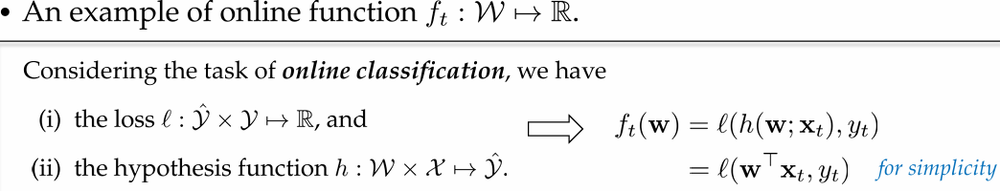
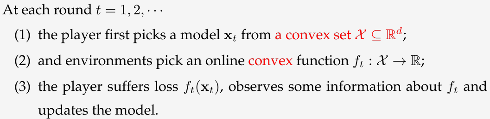
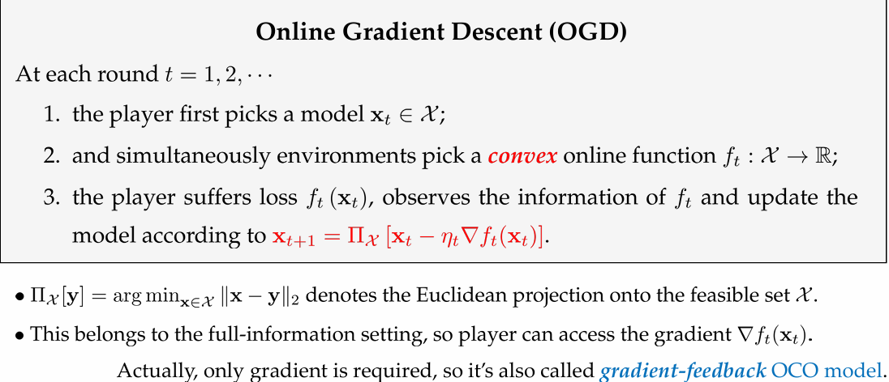
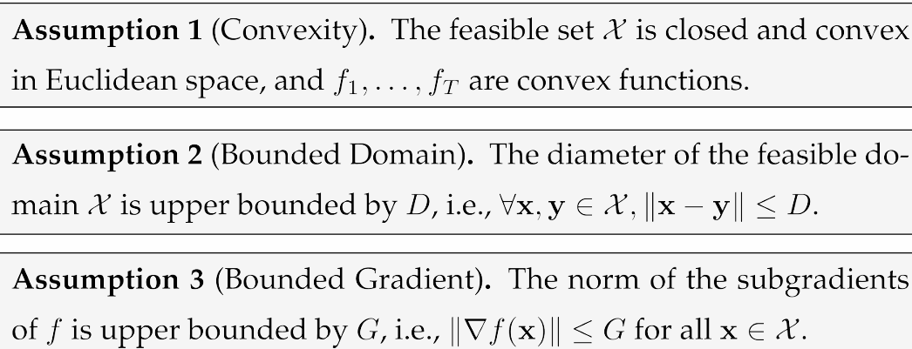
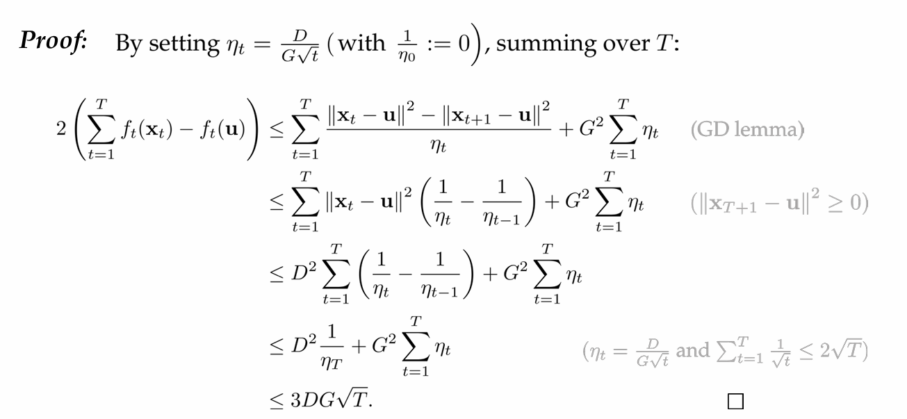
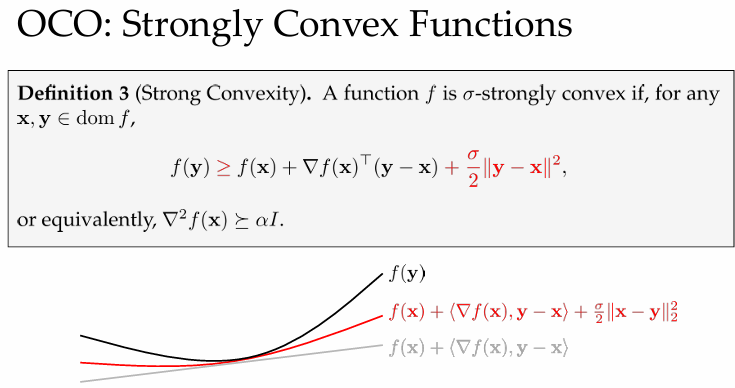
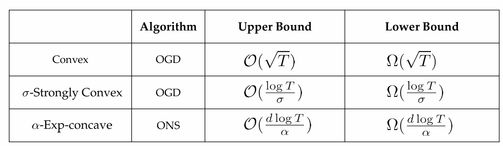

# Part 1. Online Learning
## Statistical Learning [传统统计学习]
- 目标: *Risk Minimization*[最小化风险]
- $$\min_{h\in\mathcal{H}}\mathbb{E}_{(\mathbf{x},y)\sim\mathcal{D}}[\ell(h(\mathbf{x}),y)]$$
- - $H$: 假设空间,h: 假设 [此处与模型等价]
- - (x,y): 未知分布D下的样本
- - l: loss of using hypothesis h on instance (x,y)
- 期望风险 expected risk $R(h) \overset{def}{=} E_{(x,y)\sim D}[l(h(x),y)]$
- 经验风险 empirical risk $\hat{R}_S(h) = \frac{1}{m} \sum_{i=1}^m l(h(x_i),y_i)$
- - $S = \{(x_1,y_1),\cdots,(x_m,y_m)\}$
- excess risk bound: $R(\hat{h}) - {inf}_{h\in H} R(h) \leq O(\sqrt{\frac{1}{m}})$
- - 真实风险与最优假设的风险的差距
- - 衡量学习算法的优化能力，即它是否能够在有限样本下逼近假设空间的最优解。
- generalization error bound $\hat{R}_S(\hat{h}) - R(\hat{h}) \leq O(\sqrt{\frac{1}{m}})$
- - 模型在训练集上的经验风险与在真实分布上的风险的差距
- - 衡量模型的泛化能力。

### Offline towards Online
- 传统统计学习:
- - 数据是离线的
- 在线学习
- - 数据以流的形式到达
## Online Learning: Problem and Measure
- 在线学习可以形式化为以下二者间的repeated game:
  - Player: 学习器或"learning model"
  - Environments: an abstraction of all factors evaluating the model.
- At each round $t=1,2,\cdots$
- - (1) player 选择model $w_t \in W$
- - (2) simulaneously environment 选择online function $f_t : W \to \mathbb{R}$
- - (3) player 受到$f_t(w_t)$的损失,获取$f_t$的信息并更新模型
- 
- - f与当前数据相关

- *以垃圾邮件分类为例*
- - (1) Player 给出垃圾邮件分类器 $w_t$
- - (2) 一封邮件被揭示是否为垃圾邮件
- - (3) Player 受到损失,更新分类器

### 性能度量 Performance Measure
- Statistical learning:
- - Risk: 
- - $R(h) \overset{def}{=} E_{(x,y)\sim D}[l(h(x),y)]$
- - Excess risk:
- - $\hat{R}(s) - min_{h\in H} R(h)$
- Online learning:
- - Sequential Risk: [与Risk对应]
- - $\hat{R}(\{w_t\}_{t=1}^T) = \sum_{t=1}^T f_t(w_t) = \sum_{t=1}^T l(w_t^T x_t, y_t)$
- - Regret: [与Excess risk对应]
- - $\begin{aligned}R(\{\mathbf{w}_t\}_{t=1}^T)-\min_{\mathbf{w}\in\mathcal{W}}R(\mathbf{w})=\sum_{t=1}^T\ell(\mathbf{w}_t^\top\mathbf{x}_t,y_t)-\min_{\mathbf{w}\in\mathcal{W}}\sum_{t=1}^T\ell(\mathbf{w}^\top\mathbf{x}_t,y_t)
\end{aligned}$
- - $\mathrm{Regret}_T=\sum_{t=1}^Tf_t(\mathbf{w}_t)-\min_{\mathbf{w}\in\mathcal{W}}\sum_{t=1}^Tf_t(\mathbf{w})$
- - 评估在线学习算法表现: 本身问题难度与在线学习能力
### Another View of Regret
- 目标: 最小化累计损失$\sum_{t=1}^Tf_t(\mathbf{w}_t)$
- benchmark: $\min_{\mathbf{w}\in\mathcal{W}}\sum_{t=1}^Tf_t(\mathbf{w})$ [由于损失与损失函数强相关]
- Hannan Consistency : $\frac{\mathrm{Regret}_T}T\to0\mathrm{~as~}T\to\infty$

## Online Convex Optimization[OCO]
- 一般的在线学习问题求解是NP的
- 易于求解的实例: Online Convex Optimization [OCO]
- 可行域为凸集,在线函数为凸函数

### OCO: Different Feedback
- full information: entire$f_t$ or $\Delta f_t(x_t)$
- partial information(bandits): $f_t(x_t)$ only

### OCO: Different Environments
- stochastic setting
- adversarial setting[非随机的,不假设环境的分布]
- - oblivious[f与其无关]
- - adaptive[针对模型给出测试]
- 从上到下逐渐不约束环境
- 信息越受限,obliviou和adaptive差距越大

# Part 2. Online Convex Optimization [Full-information setting]
$\textbf{Definition 2: (Convex Function)}$

$f: \mathcal{X} \mapsto \mathbb{R}$ 为凸函数:

$\forall \mathbf{x},\mathbf{y}\in\mathcal{X},\forall\alpha\in[0,1],f((1-\alpha)\mathbf{x}+\alpha\mathbf{y})
\leq(1-\alpha)f(\mathbf{x})+\alpha f(\mathbf{y}).$

若$f$可微,则有:

$f(\mathbf{y})\geq f(\mathbf{x})+\nabla f(\mathbf{x})^\top(\mathbf{y}-\mathbf{x}).$

### Convex Functions
- 
- 标准分析的三个假设:
- 

**Theorem 3 (Regret bound for OGD).**

在假设1,2,3下,online gradient descent (OGD) with step sizes $\eta _t= \frac D{G\sqrt {t}}for$ $t\in [ T]$ 有以下遗憾界:
$$\mathrm{Regret}_T=\sum_{t=1}^Tf_t(\mathbf{x}_t)-\min_{\mathbf{x}\in\mathcal{X}}\sum_{t=1}^Tf_t(\mathbf{x})
\leq\frac32GD\sqrt{T}=\mathcal{O}(\sqrt{T}).$$

- Chap3: 
$$\|\mathbf{x}_{t+1}-\mathbf{x}^\star\|^2\leq\|\mathbf{x}_t-\mathbf{x}^\star\|^2-2\eta_t(f(\mathbf{x}_t)-f^\star)+\eta_t^2\|\nabla f(\mathbf{x}_t)\|^2.$$
- OGD:
$$\|\mathbf{x}_{t+1}-u\|^2\leq\|\mathbf{x}_t-u\|^2-2\eta_t(f_t(\mathbf{x}_t)-f_t(u))+\eta_t^2\|\nabla f_t(\mathbf{x}_t)\|^2,u \in \mathcal{X^*}\\
\Rightarrow 2(f_t(\mathbf{x}_t)-f_t(\mathbf{u}))\leq\frac{\left\|\mathbf{x}_t-\mathbf{u}\right\|^2-\left\|\mathbf{x}_{t+1}-\mathbf{u}\right\|^2}{\eta_t}+\eta_tG^2
$$
- 

### Strongly Convex Functions
**Def3 Strong Convexity.**

$f$为$\sigma$-strongly convex:

$\forall \mathbf{x},\mathbf{y}\in\mathcal{X}, f(\mathbf{y})\geq f(\mathbf{x})+\nabla f(\mathbf{x})^\top(\mathbf{y}-\mathbf{x})+\frac{\sigma}{2}\|\mathbf{y}-\mathbf{x}\|^2.$

- 
- OGD for Strongly Convex Functions:
- 环境给出的函数为强凸函数,其余同上

**Theorem 4 (Regret bound for strongly-convex functions).**

在假设1,3下[不需要假设2], 对 σ-strongly convex 的损失函数, OGD with step sizes $\eta_t=\frac1{\sigma t}$ 有以下遗憾界:

$$\mathrm{Regret}_T\leq\frac{G^2}{2\sigma}(1+\log T)=\mathcal{O}(\log T).$$

### Exponentially Concave Functions
$strongly \, convex \Rightarrow exp-concave \Rightarrow convex$: 强度逐渐减弱

**Def2 Exp-concavity.**

$f$为$\alpha$-exp-concave:
$g(x) = e^{-\alpha f(x)}$ 为concave.

exp-concave:不用强凸也能有xx的界

A Comparison of Different Curvatures

- Convex

$$f(\mathbf{x})\geq f(\mathbf{y})+\nabla f(\mathbf{y})^\top(\mathbf{x}-\mathbf{y})$$

- Strongly Convex

$$f(\mathbf{x})\geq f(\mathbf{y})+\nabla f(\mathbf{y})^\top(\mathbf{x}-\mathbf{y})+\frac\sigma2\left\|\mathbf{x}-\mathbf{y}\right\|_2^2$$

- Exponentially Concave

$$\begin{aligned}f(\mathbf{x})&\geq f(\mathbf{y})+\nabla f(\mathbf{y})^\top(\mathbf{x}-\mathbf{y})+\frac\gamma2(\mathbf{x}-\mathbf{y})^\top\nabla f(\mathbf{y})\nabla f(\mathbf{y})^\top(\mathbf{x}-\mathbf{y})\\&=f(\mathbf{y})+\nabla f(\mathbf{y})^\top(\mathbf{x}-\mathbf{y})+\frac\gamma2\left\|\mathbf{x}-\mathbf{y}\right\|_{\nabla f(\mathbf{y})\nabla f(\mathbf{y})^\top}^2\end{aligned}$$

$\textbf{Lemma 3 ( Property of Exp- concavity).}$ 设 $f: \mathcal{X} \to \mathbb{R}$ 为 α-exp-concave 函数,D,G 分别表示 $X$ 的直径 和 (sub)gradients 的界.

$\forall\gamma\leq\frac12\min\left\{\frac1{GD},\alpha\right\},\mathbf{x},\mathbf{y}\in\mathcal{X}:$

$$\begin{aligned}f(\mathbf{x})&\geq\:f(\mathbf{y})+\nabla f(\mathbf{y})^\top(\mathbf{x}-\mathbf{y})+\frac\gamma2(\mathbf{x}-\mathbf{y})^\top\nabla f(\mathbf{y})\nabla f(\mathbf{y})^\top(\mathbf{x}-\mathbf{y})\\&=f(\mathbf{y})+\nabla f(\mathbf{y})^\top(\mathbf{x}-\mathbf{y})+\frac\gamma2\left\|\mathbf{x}-\mathbf{y}\right\|_{\nabla f(\mathbf{y})\nabla f(\mathbf{y})^\top}^2\end{aligned}$$

# Part 3. Connection with Offline Learning

## Application to Stochastic Optimization [SGD]

## Online-to-Batch Conversion

