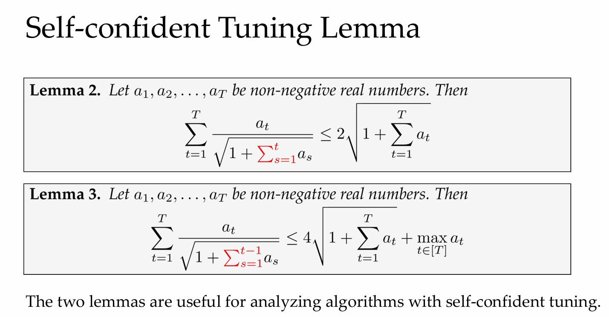

# Lecture 7. Adaptive Online Convex Optimization

# Part 1. Motivation
- 之前的讨论考虑worst-case,但现实中我们不总是关心最差情况
- 因此考虑具有如下性质的结果:
- - 在简单的问题中有更优的结果
- - 在最差情况下有相同的结果

- mini-max analysis: 适用于所有问题的结果
- small-loss bound: 适用于特定问题的结果(Beyond the worst case)

## 1.1 Minimax results

## 1.2 Beyond the worst-case analysis

## 1.3 Problem-dependent consideration

# Part 2. Small-loss for PEA
## 2.1 Refined Analysis for Hedge
**Theorem 2.** 

Suppose that $\forall t\in[T]$ and $i\in[N],0\leq\ell_{t,i}\leq1,then$ Hedge with
learning rate $\eta\in(0,1)$ guarantees

$$\sum_{t=1}^T\langle\boldsymbol{p}_t,\boldsymbol{\ell}_t\rangle-\min_{i\in[N]}\sum_{t=1}^T\ell_{t,i}\leq\frac1{1-\eta}\left(\frac{\ln N}\eta+\eta L_{T,i^\star}\right),$$

$by$ setting $\eta = \min \left \{ \frac 12, \sqrt {\frac {\ln N}{L_{T, i^{\star }}}}\right \} , we$ have the following $small- loss$ regret $bound.$
$$\mathrm{Regret}_T=\mathcal{O}\left(\sqrt{L_{T,i^\star}\log N}+\log N\right).$$

$( 1) \textit{ adaptivity:  when }L_{T, i^* }= \mathcal{O} ( 1)$,the regret bound is $\mathcal{O}(\log N)$

$( 2) \textit{ robustness:  when }L_{T, i^* }= \mathcal{O} ( T)$,the regret bound is $\mathcal{O}(\sqrt T\log N)$ , 与之前推导的minimax结果相同
## 2.2 Self-confident Tuning
- 2.1中的bound,需要$L_{T,i^\star}$的知识作为输入决定$\eta$

**Theorem 4.**
$$\begin{aligned}
 & \text{ Suppose that }\forall t\in[T]\textit{ and i }\in[N],0\leq\ell_{t,i}\leq1,\textit{ then Hedge with} \\
 & \textit{adaptive learning rate }\eta_t=\sqrt{\frac{\ln N}{\tilde{L}A_t+1}}\textit{ guarantees} \\
 & \mathrm{Regret}_T\leq6\sqrt{(L_{T,i}+1)\ln N}+36\ln N \\
 & \qquad \qquad =\mathcal{O}\left(\sqrt{L_{T,i}^*\log N}+\log N\right), \\
 & where \; \tilde{L}_t=\sum_{s=1}^t\langle\boldsymbol{p}_s,\boldsymbol{\ell}_s\rangle\text{ is cumulative loss the learner suffered at time t.}
\end{aligned}$$
- 

