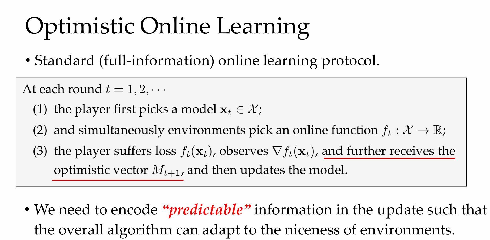
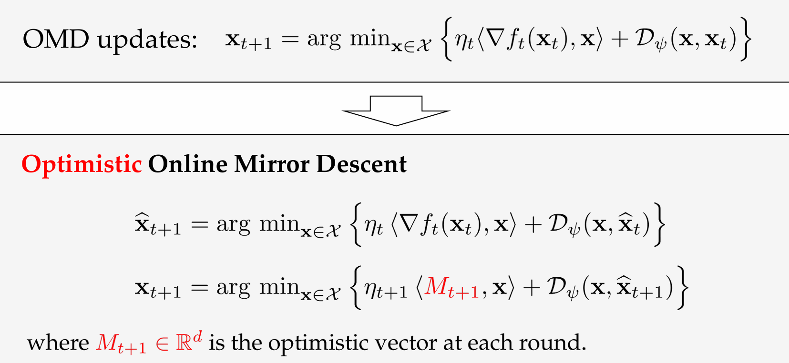
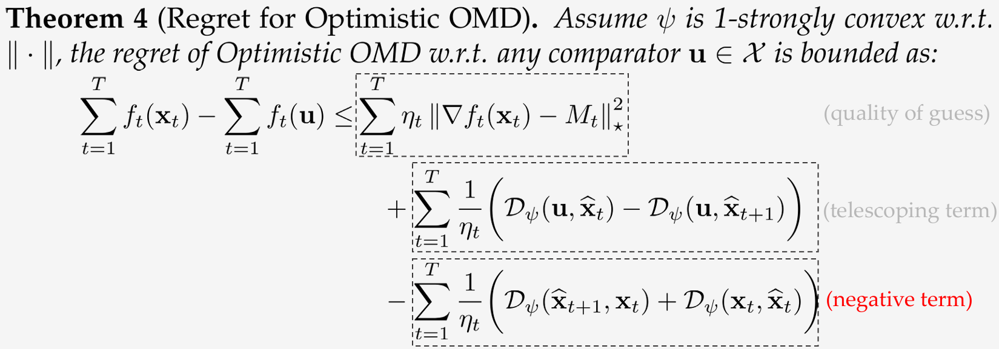

# Lecture 8. Optimistic Online Mirror Descent

# Part 1. Optimistic OMD
## 1.1 Optimistic Online Learning Setting

- 前一章给出的small-loss bound不具有普遍性$\to$ a unified framework
- "好"的环境:可预测

## 1.2 Optimistic Online Mirror Descent

- $M_{t+1} = \vec{0}$时, 退化为OMD

- proof:
$$\begin{aligned}
 & f_t(\mathbf{x}_t)-f_t(\mathbf{u})\\
 & \leq\langle\nabla f_t(\mathbf{x}_t),\mathbf{x}_t-\mathbf{u}\rangle_{\text{(convexity)}} \\
 & =\underbrace{\langle\nabla f_t(\mathbf{x}_t)-M_t,\mathbf{x}_t-\widehat{\mathbf{x}}_{t+1}\rangle}_{\mathrm{term~(a)}}+\underbrace{\langle M_t,\mathbf{x}_t-\widehat{\mathbf{x}}_{t+1}\rangle}_{\mathrm{term~(b)}}+\underbrace{\langle\nabla f_t(\mathbf{x}_t),\widehat{\mathbf{x}}_{t+1}-\mathbf{u}\rangle}_{\mathrm{term~(c)}}
\end{aligned}$$
$$
\begin{aligned}
& \mathsf{term~(a)}\leq\eta_t\left\|\nabla f_t(\mathbf{x}_t)-M_t\right\|_\star^2 \\
& \mathrm{term~}(\mathfrak{b})\leq\frac{1}{\eta_t}\left(\mathcal{D}_\psi(\widehat{\mathbf{x}}_{t+1},\widehat{\mathbf{x}}_t)-\mathcal{D}_\psi(\widehat{\mathbf{x}}_{t+1},\mathbf{x}_t)-\mathcal{D}_\psi(\mathbf{x}_t,\widehat{\mathbf{x}}_t)\right) \\
& \mathrm{term~(c)}\leq\frac{1}{\eta_t}\left(\mathcal{D}_\psi(\mathbf{u},\widehat{\mathbf{x}}_t)-\mathcal{D}_\psi(\mathbf{u},\widehat{\mathbf{x}}_{t+1})-\mathcal{D}_\psi(\widehat{\mathbf{x}}_{t+1},\widehat{\mathbf{x}}_t)\right) \\
& \Rightarrow f_t(\mathbf{x}_t)-f_t(\mathbf{u})\leq \\
& \boxed{\eta_t\left\|\nabla f_t(\mathbf{x}_t)-M_t\right\|_\star^2+\frac{1}{\eta_t}\left(\mathcal{D}_\psi(\mathbf{u},\widehat{\mathbf{x}}_t)-\mathcal{D}_\psi(\mathbf{u},\widehat{\mathbf{x}}_{t+1})\right)
-\frac{1}{\eta_t}\left(\mathcal{D}_\psi(\widehat{\mathbf{x}}_{t+1},\mathbf{x}_t)+\mathcal{D}_\psi(\mathbf{x}_t,\widehat{\mathbf{x}}_t)\right)}
\end{aligned}
$$
# Part 2. Applications
## Small-Loss Bound

## Gradient-Variance Bound

## Gradient-Variation Bound

## Gradient-Variance Bound
**Def3 :Gradient-Variance**

## Gradient-Variation Bound

## A Summary of Problem-dependent Bounds

