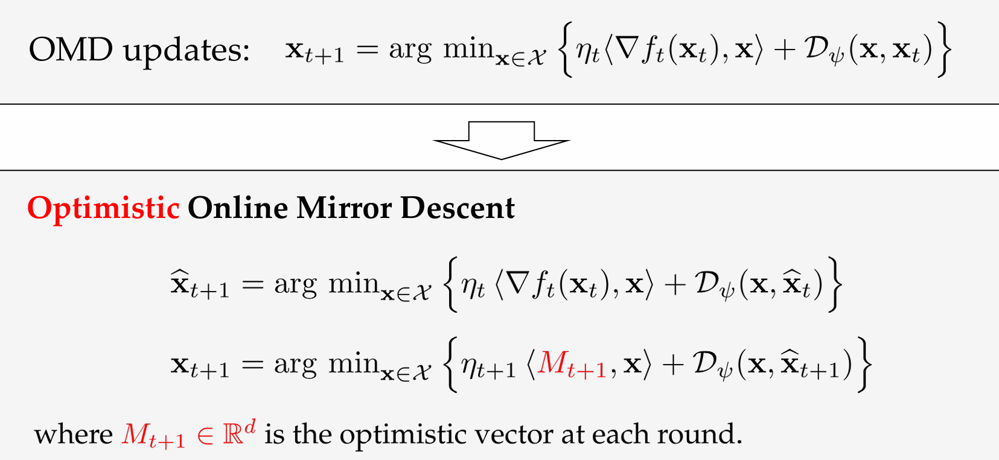

# Lecture 8. Optimistic Online Mirror Descent

# Part 1. Optimistic OMD
- 前一章给出的small-loss bound不具有普遍性$\to$ a unified framework
- "好"的环境:可预测

# Part 2. Applications
## Small-Loss Bound

## Gradient-Variance Bound

## Gradient-Variation Bound

## Gradient-Variance Bound
**Def3 :Gradient-Variance**

## Gradient-Variation Bound

## A Summary of Problem-dependent Bounds

