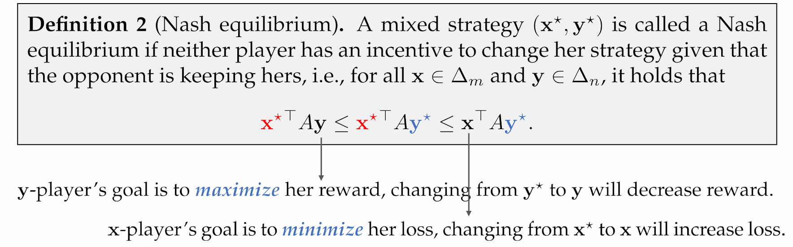
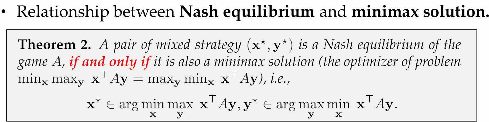
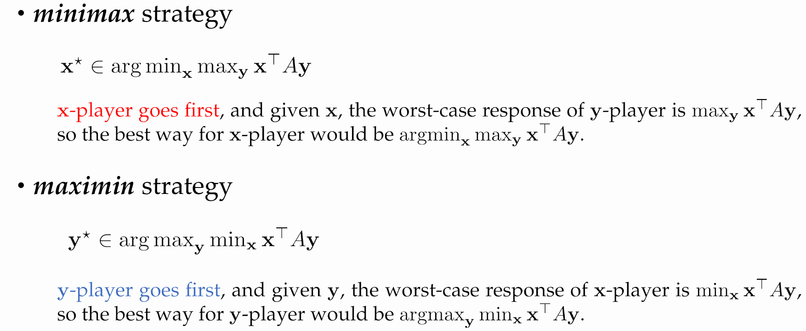
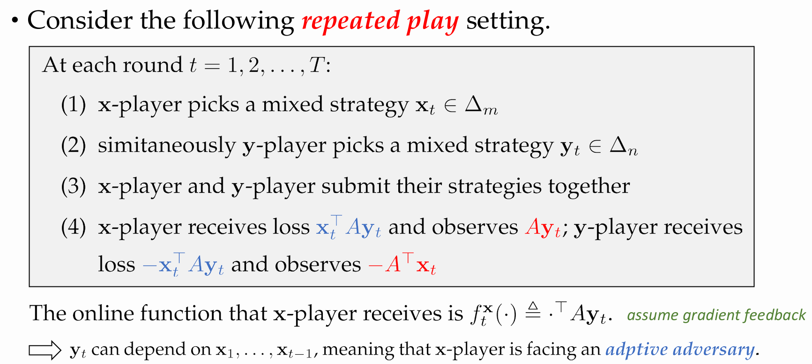
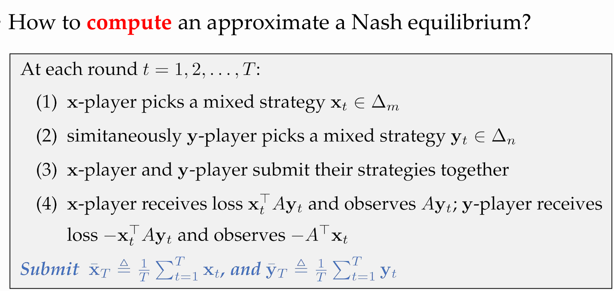
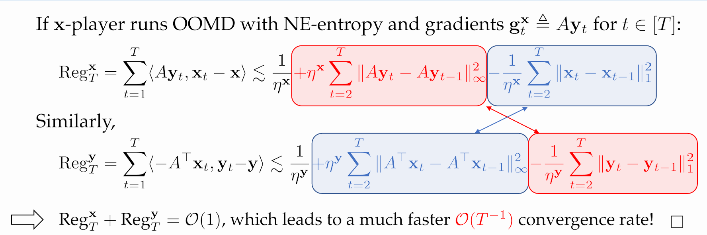

# Lecture 9. Optimism for Fast Rates

# Part 1. Online Games
## 1.1 双人零和博弈
- 形式化:
- - 游戏规则表现为矩阵 $A\in[-1,1]^{m\times n}.$
- - x-player has $m$ actions, and y-player has $n$ actions.
- - x-player 目标是最小化损失, y-player 目标是最大化收益.
- - Given the action $(\mathbf{x},\mathbf{y})\in\Delta_m\times\Delta_n$, x-player 的损失与y-player的收益均为  $\\\,\mathbb{E}[$loss$]=\sum_i\in[m]x_i\sum_{j\in[n]}y_jA_{ij}=\mathbf{x}^\top A\mathbf{y}.$

**Definition 2 : Nash equilibrium.** 

## 1.2 Minimax Theorem
**Theorem 1: Von Neumann’s Minimax Theorem**

对任意双人零和游戏 
$A\in[-1,1]^{m\times n},\mathrm{we~have}\\$
$$\min_{\mathbf{x}}\max_{\mathbf{y}}\mathbf{x}^\top A\mathbf{y}=\max_{\mathbf{y}}\min_{\mathbf{x}}\mathbf{x}^\top A\mathbf{y}.$$

- Proof:

**Theorem 2 : Relationship betweenNash equilibrium and minimax solution**

Proof:
$$\min_{\mathbf{x}}\max_{\mathbf{y}}\mathbf{x}^\top A\mathbf{y}\leq\max_{\mathbf{y}}\mathbf{x}^{\star\top} A\mathbf{y}\underset{(\mathrm{Nash})}{=}\mathbf{x}^{\star\top} A\mathbf{y}^\star\underset{(\mathrm{Nash})}{=}\min_{\mathbf{x}}\mathbf{x}^\top A\mathbf{y}^\star\leq\max_{\mathbf{y}}\min_{\mathbf{x}}\mathbf{x}^\top A\mathbf{y}$$

其中$(\mathbf{x}^\star,\mathbf{y}^\star)$是一对Nash equilibrium.
- Theorem 1 保证了最左式与最右式相等.

### Minimax Strategy and Maximin Strategy

显然有:
$$\min_{\mathbf{x}}\max_{\mathbf{y}}\mathbf{x}^\top A\mathbf{y}=\max_{\mathbf{y}}\mathbf{x}^{\star\top} A\mathbf{y}\geq \mathbf{x}^{\star\top} A\mathbf{y}^\star\geq \min\mathbf{x}^\top A\mathbf{y}^\star=\max_{\mathbf{y}}\min_{\mathbf{x}}\mathbf{x}^\top A\mathbf{y}$$

其中$\mathbf{x}^\star\in\arg\min_\mathbf{x}\max_\mathbf{y}\mathbf{x}^\top A\mathbf{y}\mathrm{~and~}\mathbf{y}^\star\in\arg\max_\mathbf{y}\min_\mathbf{x}\mathbf{x}^\top A\mathbf{y}.$

要证明Theorem 1,只需再证明$\min_{\mathbf{x}}\max_{\mathbf{y}}\mathbf{x}^\top A\mathbf{y}\leq\max_{\mathbf{y}}\min_{\mathbf{x}}\mathbf{x}^\top A\mathbf{y}$即可.

$\Rightarrow$ 考虑以下的repeated play:

## 1.3 Repeated Play

$\mathrm{Key~idea:}\mathrm{use~}\frac{1}{T}\sum_{t=1}^T\mathrm{x}_t^\top\mathrm{~Ay}_t\text{ as a bridge between min}_\mathbf{x}\max_\mathbf{y}\mathrm{~and~max}_\mathbf{y}\min_\mathbf{x}$
$$\begin{aligned}
\frac{1}{T}\sum_{t=1}^{T}\mathbf{x}_{t}^{\top}A\mathbf{y}_{t} ~
& \leq\min_{\mathbf{x}\in\Delta_{m}}\frac{1}{T}\sum_{t=1}^{T}\mathbf{x}^{\top}A\mathbf{y}_{t}+\frac{\mathrm{Reg}_{T}^{\mathbf{x}}}{T} \\
& =\min_{\mathbf{x}\in\Delta_m}\mathbf{x}^\top A\bar{\mathbf{y}}_T+\frac{\mathrm{Reg}_T^\mathbf{x}}{T}\quad(\bar{\mathbf{y}}_T\triangleq\frac{1}{T}\sum_{t=1}^T\mathbf{y}_t) \\
& \leq\max_{\mathbf{y}\in\Delta_n}\min_{\mathbf{x}\in\Delta_m}\mathbf{x}^\top A\mathbf{y}+\frac{\mathrm{Reg}_T^\mathbf{x}}{T}
\end{aligned}$$

$\mathrm{DUAL-GAP}(\bar{\mathbf{x}}_T,\bar{\mathbf{y}}_T)\triangleq\max_{\mathbf{y}\in\Delta_n}\bar{\mathbf{x}}_T^\top A\mathbf{y}-\min_{\mathbf{x}\in\Delta_m}\mathbf{x}^\top A\bar{\mathbf{y}}_T\leq2(\mathrm{Reg}_T^\mathbf{x}+\mathrm{Reg}_T^\mathbf{y})/T$

If x-player 和 y-player 使用 Hedge 算法, 则
$Reg_T^\mathbf{x} = Reg_T^\mathbf{y} = \mathcal{O} ( \sqrt T)$,即有$\mathcal{O}(T^-1/2)$的收敛速率.

## 1.4 Faster Convergence via Adaptivity
- 使用Optimistic Online Mirror Descent (OOMD)算法,以获得更快的收敛速率.

# Part 2. Accelerated Methods

## 2.1 Weighted Online-to-Batch Conversion

## 2.2 Accelerated Rates by Optimistic OMD

